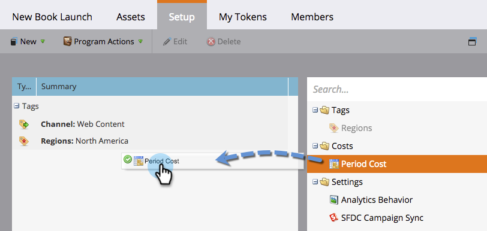
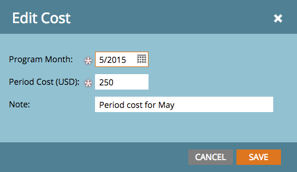

# Definir costes del período {#define-period-costs}

>[!NOTE]
>
>**Definición**
>
>Un coste de período es la cantidad que se gasta en un programa. Puede ser para uno o más meses y se utiliza para informar sobre el retorno de la inversión.

Rastree y asocie los costes de nutrición de posibles clientes y de adquisición de posibles clientes para un programa o evento definiendo cuándo y dónde desea asumir los costes de los posibles clientes.

>[!NOTE]
>
>Al principio de un programa, introduzca los costes previstos. Una vez finalizado el período en el Programa, puede editar [!UICONTROL Costo de período] e ingresar el costo real. Esto le proporcionará resultados de informes precisos.

## Definir un [!UICONTROL costo de período] {#define-a-period-cost}

1. Acceda a la ficha **[!UICONTROL Configuración]** de su programa o evento.

   

1. Arrastre y suelte **[!UICONTROL Costo de período]** en el lienzo y aparecerá el cuadro de diálogo **[!UICONTROL Nuevo costo]**.

   

1. Escriba el **[!UICONTROL Mes del programa]** que desee asociar con el costo definido.

   

1. Escriba un **[!UICONTROL Costo de período]** como un número entero sin decimales ni comas (límite máximo: 99999999)

   

   >[!NOTE]
   >
   >La divisa (por ejemplo, USD, EUR, etc.) es una configuración global administrada por un administrador de Marketo

1. Escriba una **[!UICONTROL Nota]** descriptiva (opcional) y haga clic en **[!UICONTROL Guardar]**.

   

## Editar un [!UICONTROL costo de período] {#edit-a-period-cost}

1. Haga clic con el botón derecho en [!UICONTROL Costo de período] y seleccione **[!UICONTROL Editar]** en el menú emergente para abrir el cuadro de diálogo **[!UICONTROL Editar costo]**.

   

1. Edite el coste del periodo según sea necesario

   

## Eliminar un [!UICONTROL costo de período] {#delete-a-period-cost}

1. Haga clic con el botón derecho en [!UICONTROL Costo de período] que desee eliminar y seleccione **[!UICONTROL Eliminar]** en el menú emergente para mostrar el mensaje **[!UICONTROL Eliminar costo]**.

   

1. Haga clic en **[!UICONTROL Eliminar]** para eliminar permanentemente el costo del período o en **[!UICONTROL Cancelar]** para volver.

   
