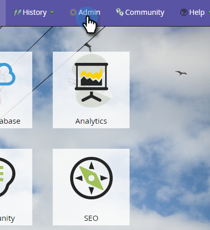

# Habilitación de la sincronización de campos personalizados para el análisis del ciclo de ingresos {#enabling-custom-field-sync-for-revenue-cycle-analytics}

Los siguientes pasos le permitirán utilizar campos personalizados en los informes de RCA.

1. Haga clic en **Administración**.

   

1. Haga clic en **Análisis del ciclo de ingresos** y luego en **Sincronización del campo personalizado**.

   

1. Seleccione su **Nombre de campo** y haga clic en **Editar opción de sincronización**.

   

1. En Estado de sincronización, seleccione **Habilitado** y haga clic en **Guardar**.

   

1. La marca de verificación verde le permite saber que el campo está configurado para la sincronización.

   

   ¡Y eso es eso!

   >[!NOTE]
   >
   >Una vez activado el campo, los datos estarán disponibles en Análisis del ciclo de ingresos al día siguiente.
