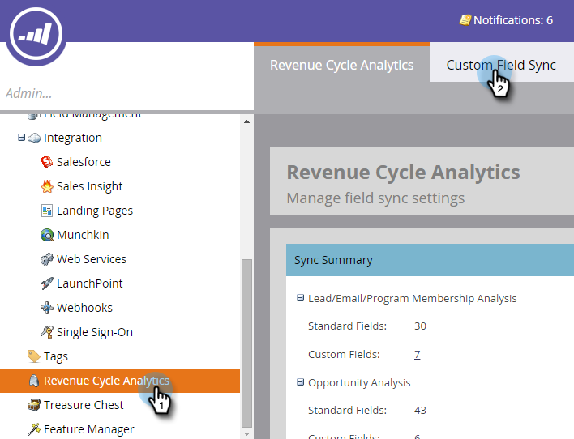
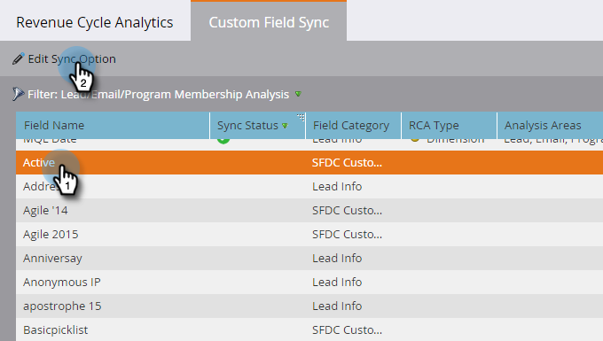

# Habilitando sincronización de campos personalizados para [!UICONTROL Revenue Cycle Analytics] {#enabling-custom-field-sync-for-revenue-cycle-analytics}

Los siguientes pasos le permitirán utilizar campos personalizados en informes RCA.

1. Haga clic en **[!UICONTROL Administrador]**.

   

1. Haga clic en **[!UICONTROL Análisis del ciclo de ingresos]** y luego en **[!UICONTROL Sincronización de campos personalizados]**.

   

1. Seleccione su **[!UICONTROL Nombre de campo]** y haga clic en **[!UICONTROL Editar opción de sincronización]**.

   

1. En **[!UICONTROL Estado de sincronización]**, seleccione **[!UICONTROL Habilitado]** y, a continuación, haga clic en **[!UICONTROL Guardar]**.

   

1. La marca de verificación verde le permite saber que el campo está configurado para sincronizarse.

   

   ¡Y eso es todo!

   >[!NOTE]
   >
   >Una vez habilitado el campo, los datos estarán disponibles en [!UICONTROL Revenue Cycle Analytics] al día siguiente.
