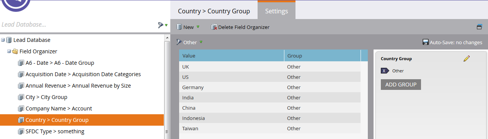

# Crear grupos de campos personalizados con el organizador de campos {#create-custom-field-groups-using-the-field-organizer}

Para poder habilitar los grupos de campos personalizados para el sistema de informes en el área Análisis de rendimiento del modelo (posibles clientes) del Explorador de ciclos de ingresos, debe categorizar los campos estándar o personalizados en grupos para el sistema de informes mediante el Organizador de campos en Administración de posibles clientes de Marketing to. Esto solo se aplica a los atributos de posibles clientes y compañías.
Cuando selecciona un campo estándar o personalizado en la lista desplegable Campo del cuadro de diálogo Nuevo organizador de campos, el sistema asigna el tipo de datos de Administración de posibles clientes de marketing asociado al campo que desea agrupar con uno de los tres editores disponibles en el Organizador de campos: cadena, entero o fecha.

| Tipo de datos de administración de posibles clientes con marketing | Tipo de datos del editor del Organizador de campos |
|---|---|
| Cadena | Cadena |
| Correo electrónico | Cadena |
| Entero | Entero |
| Texto | Cadena |
| URL | Cadena |
| Referencia | No admitido |
| Moneda | Entero |
| DateTime | Fecha |
| Booleano | No admitido |
| Teléfono | Cadena |
| Fecha | Fecha |
| Flotante | Entero |
| Calculado | No admitido |

Las tres secciones siguientes describen cómo crear un grupo de campos personalizado para un tipo de cadena, entero o fecha.

## Crear grupo de campos personalizados - Editor de cadenas {#create-custom-field-group-string-editor}

1. Haga clic en **Base de datos de posibles clientes**.

   

1. Haga clic en **Nuevo** y seleccione **Nuevo organizador de campos**.

   

1. Haga clic en **Campo** y seleccione un campo estándar o personalizado con un tipo de datos que se asigne al editor de cadenas (consulte la tabla en la sección anterior). El país se usa aquí.

   

1. Haga clic en **Crear**.

   

   El nuevo grupo personalizado se muestra en el árbol Base de datos de posibles clientes representado como Nombre de campo > Grupo de nombres de campo (ejemplo: País > Grupo de países).

   

1. Haga clic en el icono del lápiz para personalizar el nombre. Por ejemplo, puede cambiar el nombre de &quot;Grupo de países&quot; a &quot;Continente&quot;. Escriba el nombre nuevo que desee y haga clic fuera del cuadro para guardar automáticamente.

   

1. De forma predeterminada, todos los valores de datos se colocan en el subgrupo &quot;Otro&quot;. Para categorizar los valores de datos, haga clic en **Añadir grupo** para crear un subgrupo y darle un nombre.

   >[!NOTE]
   >
   >Puede agregar hasta diez subgrupos para categorizar los valores de los datos. A cada subgrupo creado se le asigna un número de ID.

   En este ejemplo, se han creado grupos para la mayoría de los continentes.

   

   >[!NOTE]
   >
   >Para eliminar un subgrupo, haga clic en la X roja junto al nombre del subgrupo. Si hay algún valor de datos en el grupo, los valores de datos se moverán al grupo predeterminado Otro.

1. Resalte un valor de datos en el lienzo y arrastre y suelte los valores de datos en el subgrupo correspondiente.

   

   >[!NOTE]
   >
   >Para eliminar un valor de datos de un subgrupo, reasigne el valor de datos al grupo predeterminado Otro.

1. Utilice la opción de filtro de la esquina superior izquierda directamente sobre el lienzo para seleccionar y vista los valores de datos en uno o varios subgrupos. Los valores de datos basados en la selección de filtros se muestran en el lienzo.

   

   >[!NOTE]
   >
   >Una vez definidos los grupos, puede activar el grupo de campos personalizados para sistemas de informes en la Análisis de rendimiento del modelo (Posibles clientes) mediante la ficha Análisis de ciclo de ingresos de Administración de posibles clientes de Marketing to.

## Crear grupo de campos personalizados - Editor de enteros {#create-custom-field-group-integer-editor}

1. Haga clic en **Base de datos de posibles clientes**.

   

1. Haga clic en **Nuevo** y seleccione **Nuevo organizador de campos**.

   

1. Haga clic en **Campo** y seleccione un campo estándar o personalizado con un tipo de datos que se asigne al editor de cadenas (consulte la tabla en la sección anterior). Los ingresos anuales se utilizan aquí.

   

1. Haga clic en **Crear**.

   

   El nuevo grupo personalizado se muestra en el árbol Base de datos de posibles clientes representado como Nombre de campo > Grupo de nombres de campo (ejemplo: Ingresos anuales > Grupo de ingresos anuales).

   

1. Haga clic en el nombre de grupo personalizado predeterminado encima del editor de enteros para personalizar el nombre. Por ejemplo, puede cambiar el nombre &quot;Grupo de ingresos anuales&quot; por &quot;Ingresos anuales por tamaño&quot;. Haga clic en **Guardar**.

   

   El editor de enteros permite crear varios subgrupos para definir cada subgrupo por tamaño. En este ejemplo, se crearán tres grupos para las empresas pequeñas, medianas y empresariales.

1. Para agregar el primer grupo, escriba un nombre en el campo **Nombre del grupo** (ejemplo: Pequeño) e introduzca un valor máximo en el campo **Intervalo de grupo** (ejemplo: 200000). Haga clic en **Añadir grupo**.

   

   Aparece una entrada de grupo vacía debajo del grupo que se acaba de introducir. El ejemplo siguiente muestra una entrada para las empresas pequeñas, medianas y empresariales.

   >[!NOTE]
   >
   >Puede agregar hasta diez subgrupos para categorizar los valores de los datos. Cada entrada de intervalo de grupo se basa en la entrada anterior. Si deja la última entrada de Rango de grupos en blanco para el último subgrupo personalizado que cree, no se establece un valor de datos máximo.

1. Haga clic en la ficha Resumen para guardar y revisar la configuración.

   

   >[!NOTE]
   >
   >Para eliminar un subgrupo, haga clic en la X roja junto al nombre del subgrupo.

1. En la página Resumen, revise la configuración.

   

   >[!NOTE]
   >
   >Una vez definidos los grupos, puede activar el grupo de campos personalizados para sistemas de informes en la Análisis de rendimiento del modelo (Posibles clientes) mediante la ficha Análisis de ciclo de ingresos de Administración de posibles clientes de Marketing to.

## Crear grupo de campos personalizados - Editor de fechas {#create-custom-field-group-date-editor}

1. Haga clic en **Base de datos de posibles clientes**.

   

1. Haga clic en **Nuevo** y seleccione **Nuevo organizador de campos**.

   

1. Haga clic en **Campo** y seleccione un campo estándar o personalizado con un tipo de datos que se asigne al editor de cadenas (consulte la tabla en la sección anterior). Aquí se utiliza la fecha de adquisición.

   

1. Haga clic en **Crear**.

   

   El nuevo grupo personalizado se muestra en el árbol Base de datos de posibles clientes representado como Nombre de campo > Grupo de nombres de campo (ejemplo: Fecha de adquisición > Grupo de fechas de adquisición).

   

1. Haga clic en el nombre de grupo personalizado predeterminado encima del editor de fechas para personalizar el nombre. Por ejemplo, puede cambiar el nombre &quot;Grupo de fechas de adquisición&quot; por &quot;Categorías de fechas de adquisición&quot;. Haga clic en **Guardar**.

   

   El editor de fechas permite crear varios subgrupos y definir cada subgrupo por fecha. En este ejemplo, se crearán tres grupos: Posibles clientes en el primer trimestre-15, en el segundo trimestre-15 y en el tercer trimestre-15.

1. Para agregar el primer grupo, escriba un nombre en el campo **Nombre del grupo** (ejemplo: P1-15 Posibles clientes) e introduzca una fecha en el campo de fecha que represente la fecha en la que se adquirió el posible cliente o antes (ejemplo: 31/03/2015 para el último día del primer trimestre (15). Haga clic en **Añadir grupo**.

   

   >[!NOTE]
   >
   >Puede agregar hasta diez subgrupos para categorizar los valores de los datos. Cada entrada de intervalo de grupo se basa en la entrada anterior. Si deja la última entrada de intervalo de grupo en blanco para el último subgrupo personalizado que cree, no se establecerá un valor de fecha de finalización.

   El ejemplo siguiente muestra una entrada para el primer trimestre de 2015 que lleva al tercer trimestre.

   

   ¡Y eso es todo! Buen trabajo.
