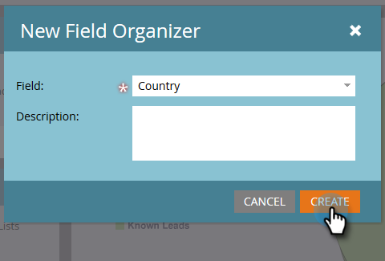

# Crear grupos de campos personalizados con el Organizador de campos {#create-custom-field-groups-using-the-field-organizer}

Para habilitar los grupos de campos personalizados para los informes en el área de análisis de rendimiento del modelo (posibles clientes) del explorador de ciclo de ingresos, debe categorizar los campos estándar o personalizados en grupos para la creación de informes mediante el Organizador de campos en Marketo Lead Management. Esto solo se aplica a los atributos de cliente potencial y compañía.
Cuando selecciona un campo estándar o personalizado en la lista desplegable Campo del cuadro de diálogo Nuevo Organizador de campos, el sistema asigna el tipo de datos Administración de posibles clientes de Marketo asociado al campo que desea agrupar con uno de los tres editores disponibles en el Organizador de campos: cadena, entero o fecha.

| Tipo de datos de administración de posibles clientes de Marketo | Tipo de datos del Editor del Organizador de campos |
|---|---|
| Cadena | Cadena |
| Email | Cadena |
| Entero | Entero |
| Texto | Cadena |
| URL | Cadena |
| Referencia | No admitido |
| Moneda | Entero |
| DateTime | Fecha |
| Booleano | No admitido |
| Teléfono | Cadena |
| Fecha | Fecha |
| Flotante | Entero |
| Calculado | No admitido |

Las tres secciones siguientes describen cómo crear un grupo de campos personalizado para un tipo de cadena, entero o fecha.

## Crear grupo de campos personalizado: editor de cadenas {#create-custom-field-group-string-editor}

1. Haga clic en **Base de datos de posibles clientes**.

   

1. Haga clic en **Nuevo** y seleccione **Nuevo Organizador de campos**.

   

1. Haga clic en **Campo** y seleccione un campo estándar o personalizado con un tipo de datos que se asigne al editor de cadenas (consulte la tabla de la sección anterior). El país se usa aquí.

   

1. Haga clic en **Crear**.

   

   El nuevo grupo personalizado se muestra en el árbol de la base de datos de posibles clientes representado como Nombre de campo > Grupo de nombres de campo (ejemplo: País > Grupo de países).

   

1. Haga clic en el icono de lápiz para personalizar el nombre. Por ejemplo, puede cambiar el nombre de &quot;Grupo de países&quot; por &quot;Continente&quot;. Escriba el nombre nuevo que desee y haga clic fuera del cuadro para guardar automáticamente.

   

1. De forma predeterminada, todos los valores de datos se colocan en el subgrupo &quot;Otro&quot;. Para categorizar los valores de datos, haga clic en **Agregar grupo** para crear un subgrupo y asignarle un nombre.

   >[!NOTE]
   >
   >Puede agregar hasta diez subgrupos para categorizar los valores de los datos. A cada subgrupo creado se le asigna un número de ID.

   En este ejemplo, se han creado grupos para la mayoría de los continentes.

   

   >[!NOTE]
   >
   >Para eliminar un subgrupo, simplemente haga clic en la X roja junto al nombre del subgrupo. Si hay algún valor de datos en el grupo, los valores de datos se moverán al grupo predeterminado Otro.

1. Resalte un valor de datos en el lienzo y arrastre y suelte los valores de datos en el subgrupo correspondiente.

   

   >[!NOTE]
   >
   >Para quitar un valor de datos de un subgrupo, reasigne el valor de los datos al grupo predeterminado Otro.

1. Utilice la opción de filtro de la esquina superior izquierda directamente encima del lienzo para seleccionar y ver los valores de datos de uno o varios subgrupos. Los valores de datos basados en la selección de filtros se muestran en el lienzo.

   

   >[!NOTE]
   >
   >Una vez definidos los grupos, puede habilitar el grupo de campos personalizados para el sistema de informes en Análisis de rendimiento del modelo (posibles clientes) mediante la pestaña Análisis del ciclo de ingresos de Administración de posibles clientes de Marketo.

## Crear grupo de campos personalizado - Editor de enteros {#create-custom-field-group-integer-editor}

1. Haga clic en **Base de datos de posibles clientes**.

   

1. Haga clic en **Nuevo** y seleccione **Nuevo Organizador de campos**.

   

1. Haga clic en **Campo** y seleccione un campo estándar o personalizado con un tipo de datos que se asigne al editor de cadenas (consulte la tabla de la sección anterior). Los ingresos anuales se usan aquí.

   

1. Haga clic en **Crear**.

   

   El nuevo grupo personalizado se muestra en el árbol de la base de datos de posibles clientes representado como Nombre de campo > Grupo de nombres de campo (ejemplo: Ingresos anuales > Grupo de ingresos anuales).

   

1. Haga clic en el nombre de grupo personalizado predeterminado encima del editor entero para personalizar el nombre. Por ejemplo, puede cambiar el nombre &quot;Grupo de ingresos anuales&quot; por &quot;Ingresos anuales por tamaño&quot;. Haga clic en **Guardar**.

   

   El editor entero permite crear varios subgrupos para definir cada subgrupo por tamaño. En este ejemplo, se crearán tres grupos para empresas pequeñas, medianas y empresariales.

1. Para agregar su primer grupo, escriba un nombre en la **Nombre del grupo** campo (ejemplo: Pequeño) e introduzca un valor máximo en la variable **Rango de grupos** campo (ejemplo: 20000). Haga clic en **Agregar grupo**.

   

   Aparece una entrada de grupo vacía debajo del grupo que acaba de ingresar. El ejemplo siguiente muestra una entrada para empresas pequeñas, medianas y empresariales.

   >[!NOTE]
   >
   >Puede agregar hasta diez subgrupos para categorizar los valores de los datos. Cada entrada de intervalo de grupo se basa en la entrada anterior. Si deja la última entrada de Rango de grupos en blanco para el último subgrupo personalizado que cree, no se establece un valor máximo de datos.

1. Haga clic en la ficha Resumen para guardar y revisar la configuración.

   

   >[!NOTE]
   >
   >Para eliminar un subgrupo, haga clic en la X roja junto al nombre del subgrupo.

1. En la página Resumen, revise la configuración.

   

   >[!NOTE]
   >
   >Una vez definidos los grupos, puede habilitar el grupo de campos personalizados para el sistema de informes en Análisis de rendimiento del modelo (posibles clientes) mediante la pestaña Análisis del ciclo de ingresos de Administración de posibles clientes de Marketo.

## Crear grupo de campos personalizado: editor de fechas {#create-custom-field-group-date-editor}

1. Haga clic en **Base de datos de posibles clientes**.

   

1. Haga clic en **Nuevo** y seleccione **Nuevo Organizador de campos**.

   

1. Haga clic en **Campo** y seleccione un campo estándar o personalizado con un tipo de datos que se asigne al editor de cadenas (consulte la tabla de la sección anterior). La fecha de adquisición se utiliza aquí.

   

1. Haga clic en **Crear**.

   

   El nuevo grupo personalizado se muestra en el árbol de la base de datos de posibles clientes representado como Nombre de campo > Grupo de nombres de campo (ejemplo: Fecha de adquisición > Grupo de fechas de adquisición).

   

1. Haga clic en el nombre de grupo personalizado predeterminado sobre el editor de fechas para personalizar el nombre. Por ejemplo, puede cambiar el nombre &quot;Grupo de fechas de adquisición&quot; por &quot;Categorías de fechas de adquisición&quot;. Haga clic en **Guardar**.

   

   El editor de fechas permite crear varios subgrupos y definir cada subgrupo por fecha. En este ejemplo, se crean tres grupos: Posibles clientes en el primer trimestre, en el segundo trimestre de 15 y en el tercer trimestre de 15.

1. Para agregar su primer grupo, escriba un nombre en la **Nombre del grupo** campo (ejemplo: Pregunta 1-15 (posibles clientes) e introduzca una fecha en el campo de fecha que represente la fecha en la que se adquirió el posible cliente (por ejemplo: 31/3/2015 para el último día del primer trimestre (1-15). Haga clic en **Agregar grupo**.

   

   >[!NOTE]
   >
   >Puede agregar hasta diez subgrupos para categorizar los valores de los datos. Cada entrada de intervalo de grupo se basa en la entrada anterior. Si deja la última entrada de intervalo de grupo en blanco para el último subgrupo personalizado que cree, no se establecerá un valor de fecha de finalización.

   El ejemplo siguiente muestra una entrada para el primer trimestre de 2015 que llega al tercer trimestre.

   

   ¡Y eso es todo! Buen trabajo.
