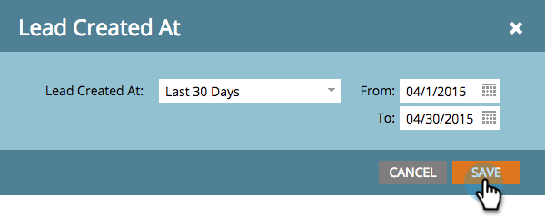

# Informe de personas por fase de ingresos {#people-by-revenue-stage-report}

Puede crear un informe que muestre en qué fase del modelo del ciclo de ingresos se encuentran sus recursos. El informe incluye cualquier fase del modelo especificado siempre y cuando haya un saldo de persona para el intervalo de fechas determinado del informe.

>[!AVAILABILITY]
>
>No todas las ediciones de Marketo incluyen esta funcionalidad. Póngase en contacto con el administrador de cuentas para obtener más información.

1. Ir a **[!UICONTROL Analytics]**.

   

1. Haga clic en el informe de **[!UICONTROL Personas por fase de ingresos]**.

   

1. Haga clic en la ficha **[!UICONTROL Configuración]**. Haga doble clic en el campo **[!UICONTROL Persona creada a las]** para establecer el lapso de tiempo deseado para informar sobre.

   

1. Edite el lapso de tiempo y haga clic en **[!UICONTROL Guardar]**.

   

1. Haga clic en la ficha **[!UICONTROL Informe]**. Ahora puede ver en qué fase del modelo de ingresos se encuentra su gente y centrarse en cualquier cuello de botella.

   
