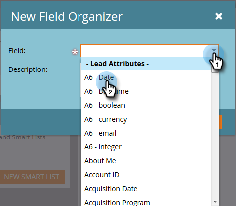

# Uso de organizadores de campo {#using-field-organizers}

Los organizadores de campos le ayudan a especificar ciertos campos de todos los valores posibles. Por ejemplo, puede crear agrupaciones significativas, como Costa oeste y Costa este, para el campo Territorio. Esto ayuda a que los informes se ejecuten más rápido.

Los organizadores de campo son similares a las segmentaciones, que se utilizan de forma genérica, pero los organizadores de campo se utilizan para los informes en el nivel de campo.

Puede tener hasta tres segmentaciones personalizadas en una lista de campos.

No hay ningún informe de organizadores de campo específico.

Los organizadores de campos se utilizan en el análisis de rendimiento del modelo.

## Cómo crear organizadores de campos {#how-to-create-field-organizers}

1. Haga clic en la **[!UICONTROL base de datos]**.

   

1. En **[!UICONTROL Nuevo]**, seleccione **[!UICONTROL Nuevo organizador de campos]**.

   

1. En **[!UICONTROL Campo]**, seleccione un atributo. La descripción es opcional.

   

1. Haga clic en **[!UICONTROL Crear]**.

   

1. Asigne un nombre al grupo e introduzca los datos adecuados (esto dependerá del tipo de datos del campo seleccionado). Haga clic en **[!UICONTROL Agregar grupo]**.

   

Cree más organizadores de campo de la misma manera, si los necesita. Y ahí estás.

>[!MORELIKETHIS]
>
>[Crear grupos de campos personalizados con el organizador de campos](/help/marketo/product-docs/reporting/revenue-cycle-analytics/revenue-tools/field-organizers/create-custom-field-groups-using-the-field-organizer.md)
