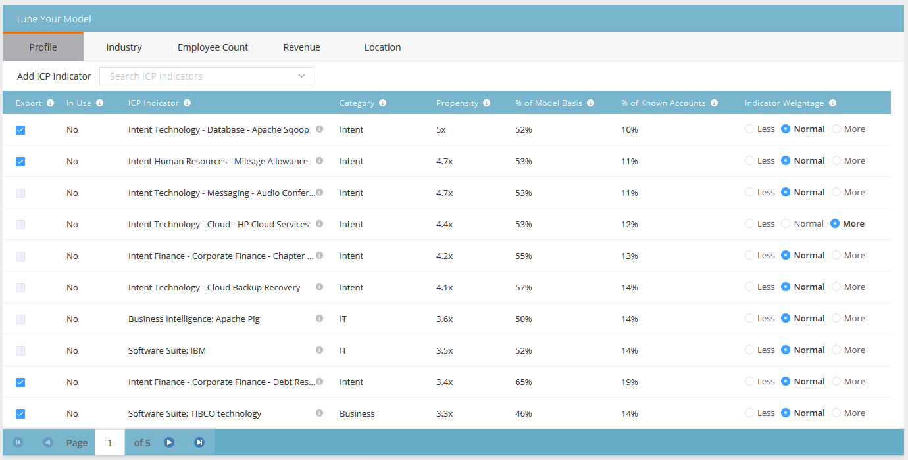

# Clasificación y ajuste de perfiles de cuenta {#account-profiling-ranking-and-tuning}

La generación de perfiles de cuenta identifica su perfil de cliente ideal (ICP), clasifica las compañías de su base de datos según ICP y agrega datos del indicador ICP a las cuentas promocionadas como cuentas con nombre.

## Resultados del modelo {#model-results}

Los resultados muestran todas sus cuentas conocidas desglosadas por grado. A es el grado más alto, D es el más bajo.

Aunque es opcional, le recomendamos que seleccione la casilla Promocionar automáticamente, ya que le ahorrará mucho tiempo. Sin embargo, si desea pasar por cada cuenta y [añadirlos manualmente](/help/marketo/product-docs/target-account-management/target/named-accounts/discover-accounts.md#discover-crm-accounts), simplemente deje la casilla sin marcar.

<table> 
 <tbody> 
  <tr> 
   <td><strong>Clasificación</strong></td> 
   <td> 
    

      Clasificación de la cuenta basada en el perfil de cliente ideal. A es el mejor ajuste, D es el menos ajustado. 
    
</td> 
  </tr> 
  <tr> 
   <td><strong>Tendencia</strong></td> 
   <td> 
    

      Aumento estimado de la tasa de conversión en comparación con una selección de cuentas no basada en ICP. 
    
</td> 
  </tr> 
  <tr> 
   <td><strong>Cuentas (%)</strong></td> 
   <td> 
    

      Porcentaje de cuentas en la entrada del modelo que tienen esta clasificación. 
    
</td> 
  </tr> 
  <tr> 
   <td><strong>% de base de modelo</strong></td> 
   <td> 
    

      Porcentaje de cuentas en base de modelo que tienen esta clasificación. 
    
</td> 
  </tr> 
 </tbody> 
</table>

## Ajuste de modelo {#model-tuning}

En la pestaña Modelo, haga clic en el botón Ajustar modelo.

Hay varias pestañas entre las que elegir, lo que permite una personalización en profundidad.

**Categorías de indicador**

<table> 
 <tbody> 
  <tr> 
   <td><strong>Cumplimiento</strong></td> 
   <td> 
    

      Certificaciones, puestos/contratación relacionados con el cumplimiento. 
    
</td> 
  </tr> 
  <tr> 
   <td><strong>Operaciones</strong></td> 
   <td> 
    

      Posiciones/contrataciones relacionadas con las operaciones. 
    
</td> 
  </tr> 
  <tr> 
   <td><strong>HR</strong></td> 
   <td> 
    

      Software de RRHH o Nómina, puestos/contratación relacionados con RRHH.
    
</td> 
  </tr> 
  <tr> 
   <td><strong>Ingeniería</strong></td> 
   <td> 
    

      Tecnologías, marcos, puestos/contratación relacionados con la ingeniería. 
    
</td> 
  </tr> 
  <tr> 
   <td><strong>Ventas</strong></td> 
   <td> 
    

      Soluciones y software para ventas, puestos/contratación relacionados con ventas. 
    
</td> 
  </tr> 
  <tr> 
   <td><strong>Intención</strong></td> 
   <td> 
    

      Indicadores de intención. 
    
</td> 
  </tr> 
  <tr> 
   <td><strong>IT</strong></td> 
   <td> 
    

      Soluciones de hardware y software, tecnologías, puestos/contratación relacionados con TI.
    
</td> 
  </tr> 
  <tr> 
   <td><strong>Finanzas</strong></td> 
   <td> 
    

      Software financiero, puestos/contratación relacionados con las finanzas. 
    
</td> 
  </tr> 
  <tr> 
   <td><strong>marketing</strong></td> 
   <td> 
    

      Tecnologías de marketing y software, puestos/contratación relacionados con el marketing. 
    
</td> 
  </tr> 
  <tr> 
   <td><strong>Negocio</strong></td> 
   <td> 
    

      Forbes o Inc listados o asociaciones de negocios. 
    
</td> 
  </tr> 
  <tr> 
   <td><strong>Experiencia del cliente y relaciones</strong></td> 
   <td> 
    

      Éxito del cliente y relaciones con el cliente/contratación.
    
</td> 
  </tr> 
 </tbody> 
</table>

Pase el ratón sobre la información del objeto para ver una descripción de cada columna.

Haga clic en la lista desplegable Agregar indicador ICP para insertar indicadores adicionales en el modelo.

Marcar la casilla Exportar permite ver el indicador ICP en la página Detalles de la cuenta con nombre, así como utilizar el indicador ICP seleccionado como restricciones en [filtros de cuenta con nombre](/help/marketo/product-docs/target-account-management/engage/account-filters.md).

>[!NOTE]
>
>Los indicadores ICP se incluyen como restricciones en **Miembro de cuenta designada** Filtros y Déclencheur.

El peso del indicador es lo que controla el nivel de importancia que cada indicador recibe en el modelo.

Haga clic en Actualizar modelo para que los cambios surtan efecto.

Cuando haya terminado de ajustar el modelo (después de actualizarlo), vuelva a la pestaña Resultados del modelo y haga clic en **Guardar y aplicar rangos**.

