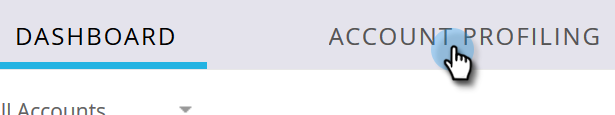
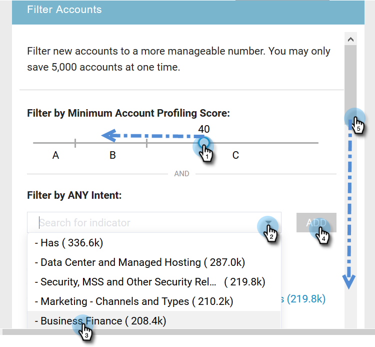
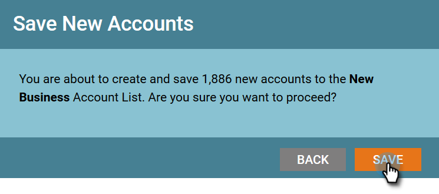

# Detección de nuevas cuentas {#new-account-discovery}

La detección de nuevas cuentas puede ayudarle a encontrar nuevas cuentas a las que dirigirse mediante recomendaciones con tecnología de IA a partir de su perfil de cliente ideal.

>[!IMPORTANT]
>
>A partir de 2025, la generación de perfiles de cuenta ya no estará disponible para los nuevos usuarios. Seguirá funcionando para los usuarios existentes.

>[!PREREQUISITES]
>
>[Configurar perfil de cuenta](/help/marketo/product-docs/target-account-management/account-profiling/setting-up-account-profiling.md)

>[!TIP]
>
>se recomienda presionar el botón **Actualizar cuentas existentes** antes de realizar una nueva búsqueda de cuentas para asegurarse de que está viendo los datos más recientes. Esta actualización puede tardar hasta 24 horas.

1. En Mi Marketo, haga clic en **[!UICONTROL Administración de cuentas de Target]**.

   

1. Haga clic en la ficha **[!UICONTROL Perfil de cuenta]**.

   

1. Haga clic en la ficha **[!UICONTROL Nuevas cuentas]**.

   

   >[!NOTE]
   >
   >[!UICONTROL Nuevas cuentas] muestra una lista de cuentas que aún no son suyas en TAM. Son cuentas que pueden ser nuevas para usted en función de los filtros que seleccione.

1. Seleccione todos los filtros aplicables (esta parte es altamente personalizable, el siguiente es solo un ejemplo para demostrar el filtrado).

   

1. Haga clic en **[!UICONTROL Guardar todo y crear lista]** en la parte inferior derecha de la página.

   

   >[!NOTE]
   >
   >Si solo ve algunas cuentas que desea, tiene la opción de hacer clic en cuentas individuales y en **Guardar cuentas seleccionadas** cuando haya terminado.

1. Puede crear su propia lista de cuentas nueva o agregarla a una existente. En este ejemplo, vamos a crear uno nuevo.

   

   >[!NOTE]
   >
   >Para guardarlo en una lista de cuentas existente, seleccione esa opción, haga clic en la lista desplegable, seleccione la lista de cuentas que desee y haga clic en **[!UICONTROL Siguiente]**.

1. Haga clic en **[!UICONTROL Guardar]**.

   

   >[!NOTE]
   >
   >Solo puede guardar hasta 5000 cuentas a la vez. Si la búsqueda arroja 10 000 resultados, debe guardar los primeros 5000 (principales), restablecer los filtros y guardar los 5000 siguientes. El límite de la cuenta **total** es de un millón.

1. Haga clic en **[!UICONTROL Aceptar]**.

   

   >[!TIP]
   >
   >Una vez guardadas las cuentas, puede usar una audiencia [coincidente en [!DNL LinkedIn]](/help/marketo/product-docs/target-account-management/target/create-an-account-matched-audience-on-linkedin.md) para segmentarlas.
