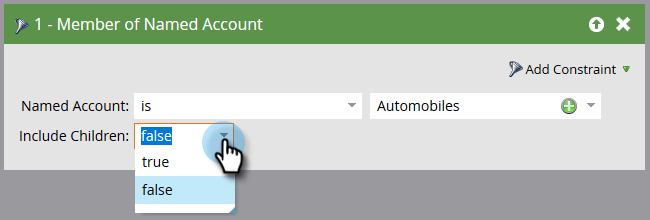

# Filtros de cuenta {#account-filters}

Identifique y comprometa las cuentas con nombre y las personas incluidas en ellas mediante nuevos filtros centrados en la cuenta.

## Filtros ABM {#abm-filters}

1. Seleccione la campaña inteligente y haga clic en **Smart List**.

   

1. Haga clic en **+** para expandir la carpeta **Filtros de cuenta**.

   

1. Arrastre los filtros que desee utilizar al lienzo.

   

## Miembro de la lista de cuentas {#member-of-account-list}

Para utilizar este filtro, haga clic en la lista desplegable de cuentas...

...y elija la lista de cuentas que desee.

>[!NOTE]
>
>Para el filtro Lista de miembros de cuenta, solo hay un calificador: &quot;is&quot;: no están disponibles los calificadores adicionales (como &quot;is not&quot; y &quot;is any&quot;).

## Miembro de la cuenta con nombre {#member-of-named-account}

1. Elija un calificador. Es para una cuenta con nombre específica o cualquiera para una cuenta con nombre.

   

1. Haga clic en el menú desplegable cuenta con nombre .

   

1. Elija las cuentas con nombre que desee.

   

1. Si utiliza el calificador &quot;es cualquiera&quot;, puede que desee utilizar [restricciones](/help/marketo/product-docs/core-marketo-concepts/smart-lists-and-static-lists/using-smart-lists/add-a-constraint-to-a-smart-list-filter.md) para restringir los resultados de búsqueda. ¡Añade tantos como quieras!

   

1. Configure &quot;Incluir elementos secundarios&quot; en false si solo desea miembros de la cuenta de nivel superior. Seleccione true si desea miembros de todas las cuentas secundarias.

   

>[!MORELIKETHIS]
>
>[Déclencheur de cuenta](/help/marketo/product-docs/target-account-management/engage/account-triggers.md)
