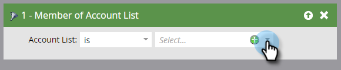

# [!UICONTROL Filtros de cuenta] {#account-filters}

Identifique y comprometa las cuentas con nombre y las personas que las componen mediante nuevos filtros centrados en las cuentas.

## Filtros TAM {#tam-filters}

1. Seleccione su campaña inteligente y haga clic en **[!UICONTROL Smart List]**.

   

1. Haga clic en **+** para expandir la carpeta **[!UICONTROL Filtros de cuenta]**.

   

1. Arrastre los filtros que desee utilizar al lienzo.

   

## [!UICONTROL Lista de miembros de la cuenta] {#member-of-account-list}

Para usar este filtro, haga clic en la lista desplegable **[!UICONTROL Lista de cuentas]**...

...y elija las listas de cuentas que desee.

>[!NOTE]
>
>Para el filtro [!UICONTROL Lista de miembros de la cuenta], solo hay un calificador: &quot;[!UICONTROL is]&quot; - Los calificadores adicionales (como &quot;no es&quot; y &quot;es cualquiera&quot;) no están disponibles.

## [!UICONTROL Miembro de cuenta con nombre] {#member-of-named-account}

Primero, elija un calificador. **[!UICONTROL is]** para una(s) cuenta(s) con nombre específico(s) o **[!UICONTROL is any]** para cualquier cuenta con nombre.

Haga clic en la lista desplegable Cuenta con nombre...

... y elija las cuentas con nombre que desee.

Si usa el calificador &quot;[!UICONTROL es cualquier]&quot;, quizá quiera usar [restricciones](/help/marketo/product-docs/core-marketo-concepts/smart-lists-and-static-lists/using-smart-lists/add-a-constraint-to-a-smart-list-filter.md) para reducir los resultados de búsqueda. ¡Añada tantos como desee!

Establezca &quot;[!UICONTROL Incluir elementos secundarios]&quot; en **[!UICONTROL false]** si solo desea miembros de la cuenta única de nivel superior. Seleccione **[!UICONTROL true]** si desea miembros de todas las cuentas secundarias.

>[!MORELIKETHIS]
>
>[Déclencheur de cuenta](/help/marketo/product-docs/target-account-management/engage/account-triggers.md)
