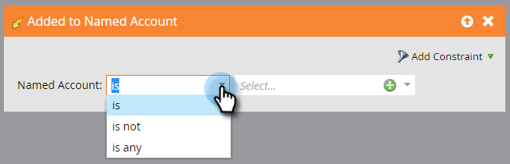

# Déclencheur de cuenta {#account-triggers}

Escuche y actúe en actividades de comportamiento importantes a nivel de cuenta en diferentes canales (por ejemplo, correo electrónico, web, anuncios) mediante déclencheur a nivel de cuenta.

Seleccione la campaña inteligente y haga clic en **[!UICONTROL Smart List]**.

Escriba &quot;Cuenta con nombre&quot; en el cuadro de búsqueda para encontrar ambos déclencheur de cuenta con nombre.

Arrastre el déclencheur que desee al lienzo. En este ejemplo utilizamos _Añadido a la cuenta con nombre_.

Elija un calificador.

Haga clic en la lista desplegable de cuentas con nombre...

...y elija las cuentas con nombre que desee.

¡Eso es todo! Cuando termine el resto de la campaña inteligente, recuerde activarla.

>[!MORELIKETHIS]
>
>[Filtros de la cuenta](/help/marketo/product-docs/target-account-management/engage/account-filters.md)
