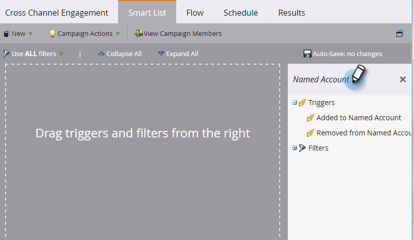
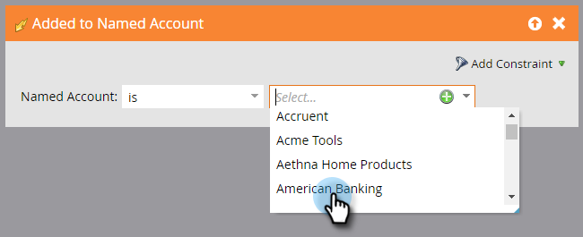

# Activadores de la cuenta {#account-triggers}

Escuche y actúe en actividades de comportamiento importantes a nivel de cuenta en diferentes canales (por ejemplo, correo electrónico, web, anuncios) mediante déclencheur a nivel de cuenta.

Seleccione su campaña inteligente y haga clic en **[!UICONTROL Smart List]**.

Escriba &quot;[!UICONTROL Cuenta con nombre]&quot; en el cuadro de búsqueda para encontrar las dos déclencheur de [!UICONTROL Cuenta con nombre].

Arrastre el déclencheur que desee al lienzo. En este ejemplo utilizamos _[!UICONTROL Se agregó a la cuenta con nombre]_.

Elija un calificador.

Haga clic en la lista desplegable Cuenta con nombre...

... y elija las cuentas con nombre que desee.

Después de finalizar el resto de la campaña inteligente, asegúrese de activarla.

>[!MORELIKETHIS]
>
>[Filtros de cuenta](/help/marketo/product-docs/target-account-management/engage/account-filters.md)
