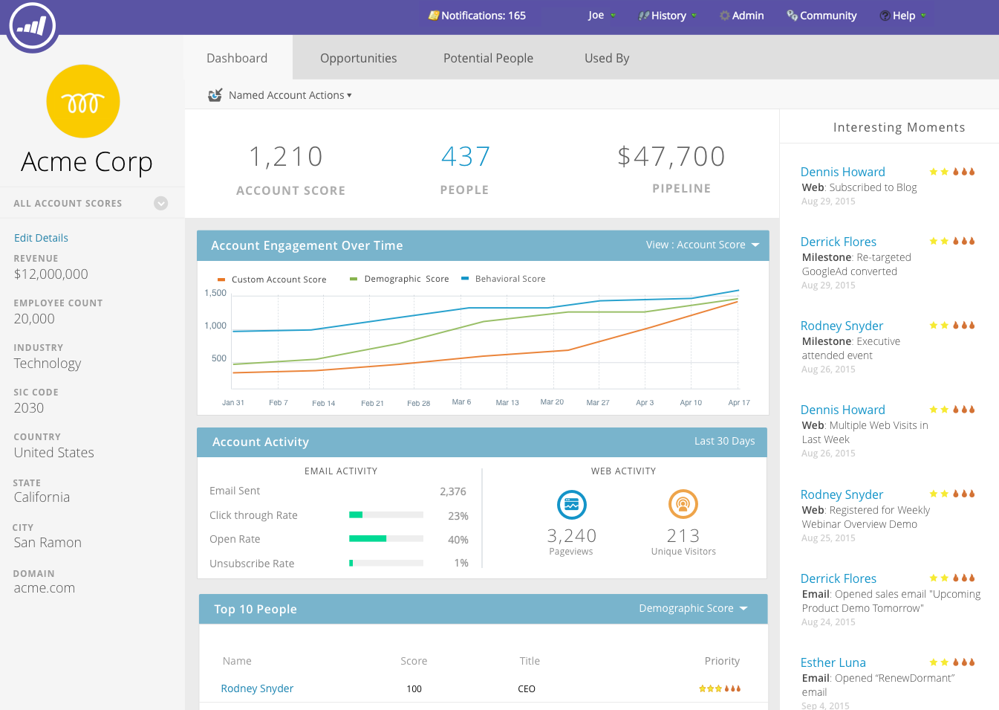

# Panel principal de ABM {#abm-main-dashboard}

El tablero principal proporciona un resumen de los esfuerzos de marketing basado en cuentas. Puede ver las cuentas o listas de cuentas de destino que muestran éxito y las que necesitan más atención.

Para filtrar por lista de cuenta, haga clic en la lista desplegable Ver...

...y realice una selección. En este ejemplo, elegimos nuestra lista de cuentas de &quot;Alta tecnología&quot;.

Para ver el [Panel de la lista de cuentas](/help/marketo/product-docs/target-account-management/measure/account-list-insights.md#account-list-dashboard), haga clic en el nombre de la lista de cuentas seleccionada...

...y el tablero se carga.

Si en lugar de ver el Tablero de lista de cuentas desea explorar en profundidad una cuenta con nombre, haga clic en **Más detalles** bajo su nombre...

...y vea las [perspectivas de la cuenta con nombre](/help/marketo/product-docs/target-account-management/measure/named-account-insights.md).

