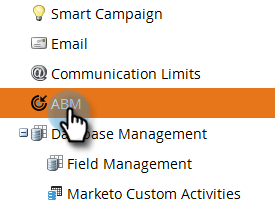

# Configuración de informes de ABM {#abm-report-setup}

El informe de ventas de ABM es un correo electrónico personalizado y semanal que se envía al equipo de la cuenta.

## Configuración de informes {#report-setup}

1. Haga clic en **Admin**.

   

1. Haga clic en **ABM**.

   

1. En Informe semanal, haga clic en **Editar**.

   

1. Haga clic en la lista desplegable **Day** y seleccione el día de la semana en el que desea que los destinatarios reciban el correo electrónico.

   

1. Para determinar el diseño del correo electrónico, haga clic en la lista desplegable **Ordenar por** y realice una selección.

   

1. Marque la casilla **Users** , luego haga clic en la lista desplegable y seleccione quién desea recibir el correo electrónico.

   

   >[!NOTE]
   >
   >Las notificaciones solo se enviarán a los propietarios de cuentas o a los integrantes del equipo.

1. Haga clic en **Guardar**.

   

¡Y eso es todo!

## Cómo cancelar la suscripción {#how-to-unsubscribe}

Cada informe incluye la opción de exclusión. Para ello, haga clic en **Unsubscribe** en la parte inferior del correo electrónico.

## Cómo volver a suscribirse {#how-to-resubscribe}

1. Haga clic en **Admin**.

   

1. Haga clic en **ABM**.

   

1. En Informe semanal, haga clic en el número que aparece como Cancelación de suscripción.

   

1. Haga clic en la lista desplegable Usuarios .

   

1. Seleccione de nuevo el usuario al que desea recibir correos electrónicos y haga clic en **Volver a suscribirse**.

   
