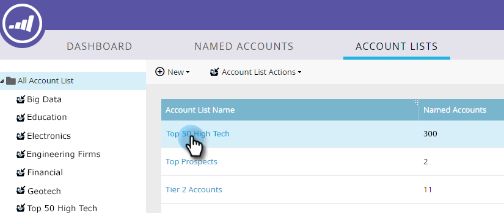

# Información sobre la lista de cuentas {#account-list-insights}

El panel Lista de cuentas ofrece una vista de las perspectivas agregadas de todas las cuentas con nombre de esa lista.

>[!NOTE]
>
>Marketo TAM determina automáticamente las cuentas con nombres principales dentro de una lista de cuentas en función de las puntuaciones de participación de cuentas o generadas por la canalización.

## Tablero de lista de cuentas {#account-list-dashboard}

Para ver el tablero de una lista de cuentas, simplemente haga clic en su nombre...

...y aparece el tablero de mandos.

<table>
 <tbody>
  <tr>
   <td colspan="1"><strong>En preparación</strong></td>
   <td colspan="1">Ver la canalización a lo largo del tiempo. Para determinar la canalización a lo largo del tiempo y por semana, utilizamos la canalización en el último día.</td>
  </tr>
  <tr>
   <td><strong>Ingresos</strong></td>
   <td>
Ver ingresos con el tiempo. Para determinar los ingresos en el tiempo por semana, tomamos la suma de todos los ingresos obtenidos en esa semana.
</td>
  </tr>
 </tbody>
</table>

## Pestaña Cuentas con nombre {#named-accounts-tab}

Haga clic en la ficha **[!UICONTROL Cuentas con nombre]** para ver qué cuentas con nombre pertenecen a esa lista de cuentas.

>[!NOTE]
>
>Puede quitar una cuenta con nombre en esta ficha seleccionándola y haciendo clic en **[!UICONTROL Quitar cuentas con nombre]**.

## [!UICONTROL Utilizado Por] Ficha {#used-by-tab}

Haga clic en la ficha **[!UICONTROL Utilizado por]** para ver qué recursos hacen referencia a esa lista de cuentas.

