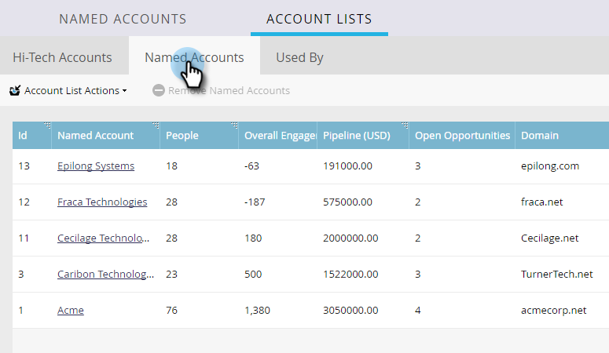

# Información de la lista de cuentas {#account-list-insights}

El panel Lista de cuentas ofrece una vista de las perspectivas agregadas de todas las cuentas con nombre dentro de esa lista.

>[!NOTE]
>
>Marketo TAM determina automáticamente las cuentas con mayor nombre dentro de una lista de cuentas en función de la canalización generada o las puntuaciones de participación de la cuenta.

## Panel de lista de cuentas {#account-list-dashboard}

Para ver el panel de una lista de cuentas, simplemente haga clic en su nombre...

...y aparece el tablero.

<table> 
 <tbody> 
  <tr> 
   <td colspan="1"><strong>En preparación</strong></td> 
   <td colspan="1">Consulte la canalización a lo largo del tiempo. Para determinar la canalización a lo largo del tiempo cada semana, tomamos la canalización el último día.</td> 
  </tr> 
  <tr> 
   <td><strong>Ingresos</strong></td> 
   <td>
Consulte ingresos a lo largo del tiempo. Para determinar los ingresos a lo largo del tiempo por semana, tomamos la suma de todos los ingresos obtenidos en esa semana.
</td> 
  </tr> 
 </tbody> 
</table>

## Pestaña Cuentas con nombre {#named-accounts-tab}

Haga clic en el **Cuentas con nombre** para ver qué cuentas con nombre pertenecen a esa lista de cuentas.

>[!NOTE]
>
>Puede quitar una cuenta con nombre en esta pestaña seleccionándola y haciendo clic en **Eliminar cuentas con nombre**.

## Utilizado por la pestaña {#used-by-tab}

Haga clic en el **Utilizado por** para ver qué recursos hacen referencia a esa lista de cuentas.

