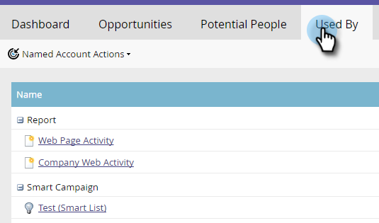

# Perspectivas de la cuenta con nombre {#named-account-insights}

El panel de cuentas con nombre proporciona una vista de 360 grados de una cuenta de destino.

## Panel {#dashboard}

El panel agrega perspectivas clave a nivel de cuenta de todas las personas dentro de una cuenta con nombre, evitando así la necesidad de dirigirse a cada persona para evaluar su progreso. Puede profundizar en la actividad del correo electrónico mediante [Perspectivas de correo electrónico](/help/marketo/product-docs/reporting/email-insights/filtering-in-email-insights.md#account-based-marketing).

>[!NOTE]
>
>Los gráficos muestran las perspectivas de los últimos 90 días.

**Participación de la cuenta a lo largo del** tiempoHaga clic en el menú desplegable  **** Vista a la derecha para cambiar lo que ve. Además de Puntuación de cuenta, puede ver por Ingresos totales...

...o Canalización.

<table> 
 <tbody> 
  <tr> 
   <td><strong>Puntuación de la cuenta</strong></td> 
   <td>
Consulte Participación de semana a semana basada en todas las puntuaciones de cuenta creadas en Administración. Puede comparar estas puntuaciones de cuenta en paralelo. Para determinar la participación semanal, tomamos la participación máxima de cualquier día de la semana.
</td> 
  </tr> 
  <tr> 
   <td><strong>Canalización</strong></td> 
   <td>Consulte la canalización a lo largo del tiempo. Para determinar la canalización a lo largo del tiempo cada semana, tomamos la canalización el último día.</td> 
  </tr> 
  <tr> 
   <td><strong>Ingresos</strong></td> 
   <td>Consulte ingresos a lo largo del tiempo. Para determinar los ingresos a lo largo del tiempo por semana, tomamos la suma de todos los ingresos obtenidos en esa semana.</td> 
  </tr> 
 </tbody> 
</table>

**Momentos interesantes**

Disponible para los usuarios de Marketo Sales Insight, vea los momentos interesantes resumidos a nivel de cuenta.

**Personas principales**

Estas personas se calculan en función de prioridades basadas en la actualización o la urgencia mostradas por personas de cuentas con nombre (igual que [Mejores apuestas](/help/marketo/product-docs/marketo-sales-insight/msi-for-salesforce/features/stars-and-flames/priority-urgency-relative-score-and-best-bets.md) en Perspectiva de ventas) o puntuaciones definidas por el usuario. **** La prioridad solo está disponible para los usuarios de Marketo Sales Insight.

**Incluye elementos secundarios**

Haga clic en **Incluye elementos secundarios** para ver y elegir las cuentas secundarias de la cuenta nombrada seleccionada y ver sus análisis agregados.

>[!NOTE]
>
>Al seleccionar cuentas, puede elegir seleccionar todas o seleccionar individualmente hasta 100.

## Jerarquía {#hierarchy}

Ver dónde se encuentra la cuenta con nombre seleccionada en relación con su jerarquía.

## Oportunidades {#opportunities}

Una vista resumida de todas las oportunidades abiertas a nivel de cuenta, lo que ayuda a los equipos de marketing a centrarse en cerrar oportunidades específicas.

## Personas potenciales {#potential-people}

La coincidencia entre posibles clientes y cuenta utiliza una lógica difusa para encontrar coincidencias débiles que se pueden resolver en la pestaña Personas potenciales .

>[!NOTE]
>
>Para agregar cualquiera de las personas de la lista, selecciónelas y haga clic en **Agregar personas**.

## Utilizado por {#used-by}

Esta ficha muestra qué campañas inteligentes, campañas web, listas inteligentes o informes hacen referencia actualmente a cuentas o listas de cuentas con nombre específicas.

## Equipo de cuenta {#account-team}

Vea miembros del equipo de la cuenta, agregue o elimine miembros, incluso asigne un propietario de cuenta en esta pestaña.

>[!NOTE]
>
>Haga clic en la lista desplegable **Acciones del equipo de cuenta** para agregar o eliminar miembros de la cuenta, o asignar un propietario de la cuenta.

## Indicadores PCI {#icp-indicators}

Vea los indicadores ICP que seleccionó para exportar cuando [ajustó el modelo](/help/marketo/product-docs/target-account-management/account-profiling/account-profiling-ranking-and-tuning.md#model-tuning).

