# Información sobre la cuenta con nombre {#named-account-insights}

El Tablero de cuentas con nombre proporciona una vista de 360 grados de una cuenta de destino.

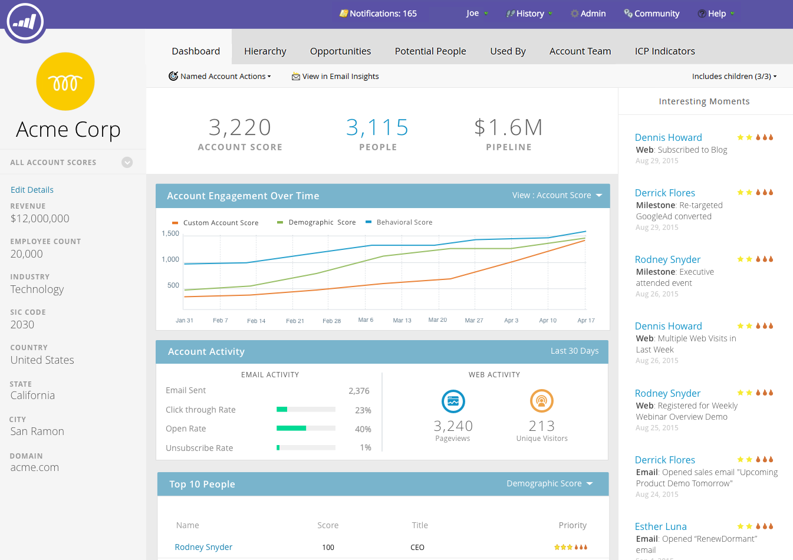

## Panel de control {#dashboard}

El tablero agrega perspectivas clave a nivel de cuenta de todas las personas de una cuenta con nombre, lo que evita la necesidad de dirigirse a cada persona para evaluar su progreso. Puede profundizar en la actividad del correo electrónico mediante [Perspectivas de correo electrónico](/help/marketo/product-docs/reporting/email-insights/filtering-in-email-insights.md#account-based-marketing).

>[!NOTE]
>
>Los gráficos muestran datos de los últimos 90 días.

**[!UICONTROL Participación de la cuenta a lo largo del tiempo]** Haga clic en el menú desplegable **[!UICONTROL Ver]** que hay a la derecha para cambiar por qué ve. Además de [!UICONTROL Puntuación de cuenta], puede ver por [!UICONTROL Ingresos totales]...

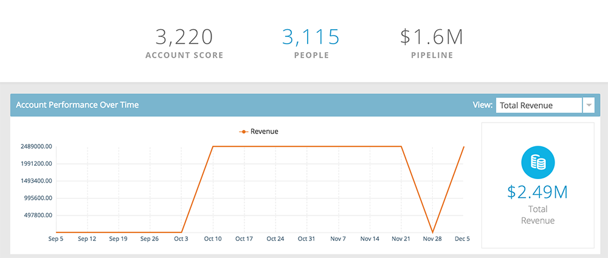

...o [!UICONTROL Canalización].

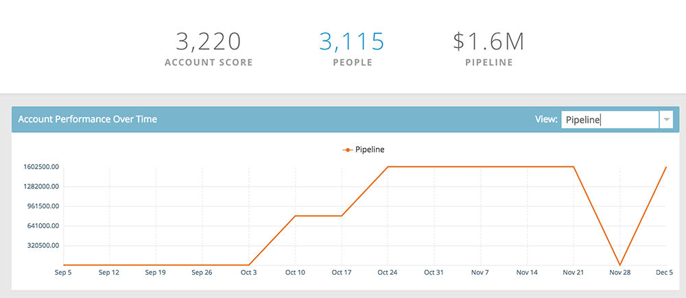

<table>
 <tbody>
  <tr>
   <td><strong>Calificación de la cuenta</strong></td>
   <td>
Ver la participación de una semana a otra en función de todas las puntuaciones de la cuenta que hayas creado en Admin. Puede comparar estas puntuaciones de cuenta en paralelo. Para determinar la participación semanal, tomamos la participación máxima de cualquier día de la semana.
</td>
  </tr>
  <tr>
   <td><strong>En preparación</strong></td>
   <td>Ver la canalización a lo largo del tiempo. Para determinar la canalización a lo largo del tiempo y por semana, utilizamos la canalización en el último día.</td>
  </tr>
  <tr>
   <td><strong>Ingresos</strong></td>
   <td>Ver ingresos con el tiempo. Para determinar los ingresos en el tiempo por semana, tomamos la suma de todos los ingresos obtenidos en esa semana.</td>
  </tr>
 </tbody>
</table>

**[!UICONTROL Momentos interesantes]**

Disponible para los usuarios de [!DNL Marketo Sales Insight], vea los momentos interesantes resumidos a nivel de cuenta.

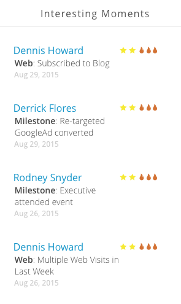

**Personas principales**

Estas personas se calculan según las prioridades que se basen en la actualización o la urgencia que muestren las personas de cuentas con nombre (lo mismo que los [resultados más probables](/help/marketo/product-docs/marketo-sales-insight/msi-for-salesforce/features/stars-and-flames/priority-urgency-relative-score-and-best-bets.md) en Sales Insight) o las puntuaciones definidas por el usuario. **[!UICONTROL Prioridad]** solo está disponible para los usuarios de [!DNL Marketo Sales Insight].

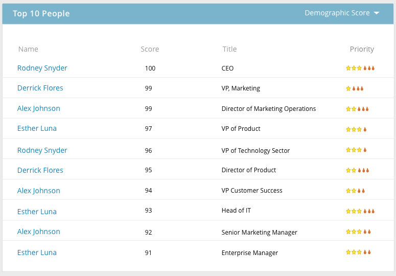

**Incluye elementos secundarios**

Haga clic en **[!UICONTROL Incluye elementos secundarios]** para ver y elegir las cuentas secundarias de la cuenta con nombre seleccionada y ver el análisis agregado.

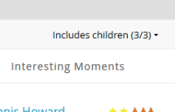

>[!NOTE]
>
>Al seleccionar cuentas, puede elegir Seleccionar todo o seleccionar individualmente hasta 100.

## Jerarquía {#hierarchy}

Ver dónde se encuentra la cuenta con nombre seleccionada en relación con su jerarquía.

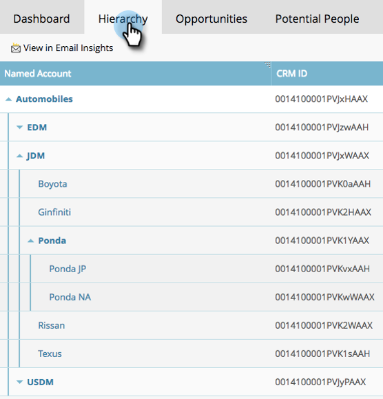

## [!UICONTROL Oportunidades] {#opportunities}

Una vista resumida de todas las oportunidades abiertas a nivel de cuenta, que ayuda a los equipos de marketing a centrarse en cerrar oportunidades específicas.

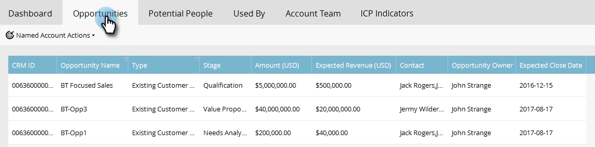

## [!UICONTROL Personas potenciales] {#potential-people}

La coincidencia de cliente potencial con cuenta usa lógica difusa para encontrar coincidencias débiles que se pueden resolver en la ficha [!UICONTROL Personas potenciales].

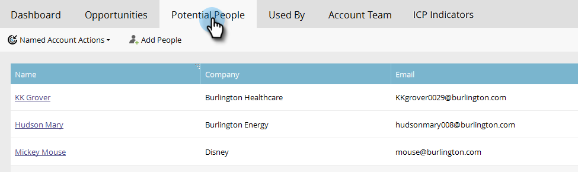

>[!NOTE]
>
>Para agregar a cualquiera de las personas de la lista, selecciónelas y haga clic en **[!UICONTROL Agregar personas]**.

## [!UICONTROL Utilizado por] {#used-by}

Esta pestaña muestra qué campañas inteligentes, campañas web, listas inteligentes o informes hacen referencia actualmente a cuentas con nombre o listas de cuentas específicas.

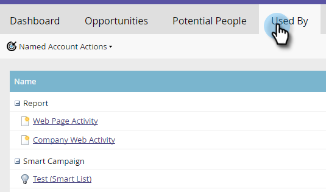

## [!UICONTROL Equipo de cuenta] {#account-team}

Vea los miembros del equipo de cuentas, agregue o elimine miembros, e incluso asigne un propietario de cuenta en esta pestaña.

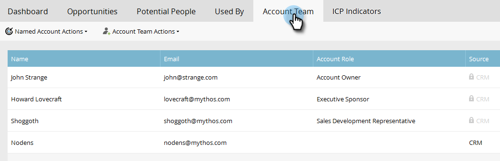

>[!NOTE]
>
>Haga clic en el menú desplegable **[!UICONTROL Acciones del equipo de cuenta]** para agregar o quitar miembros de la cuenta o asignar un propietario de cuenta.

## [!UICONTROL Indicadores ICP] {#icp-indicators}

Ver los [!UICONTROL indicadores ICP] que seleccionó para exportar al [ajustar el modelo](/help/marketo/product-docs/target-account-management/account-profiling/account-profiling-ranking-and-tuning.md#model-tuning).

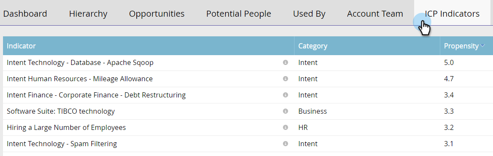
