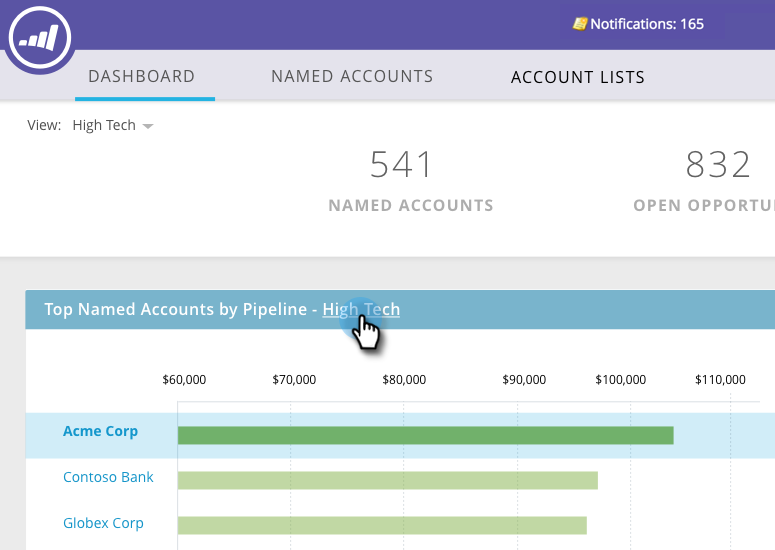

# Panel de control principal de TAM {#tam-main-dashboard}

El panel principal proporciona un resumen de sus esfuerzos de [!UICONTROL Administración de cuentas de Target]. Puede ver las cuentas de destino o las listas de cuentas que se muestran correctas y las que requieren más atención.

Para filtrar por lista de cuentas, haga clic en la lista desplegable **[!UICONTROL Ver]**...

...y haga una selección. En este ejemplo, elegimos nuestra lista de cuentas de &quot;**[!UICONTROL alta tecnología]**&quot;.

Para ver el [Panel de lista de cuentas](/help/marketo/product-docs/target-account-management/measure/account-list-insights.md#account-list-dashboard), haga clic en el nombre de la lista de cuentas que seleccionó...

...y el tablero se carga.

Si en lugar de ver el panel Lista de cuentas desea explorar en profundidad una cuenta con nombre, haga clic en **[!UICONTROL Más detalles]** bajo su nombre...

...y vea las [perspectivas de la cuenta con nombre](/help/marketo/product-docs/target-account-management/measure/named-account-insights.md).

