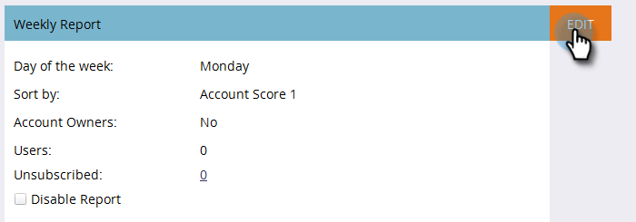
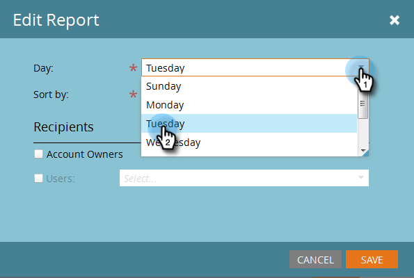
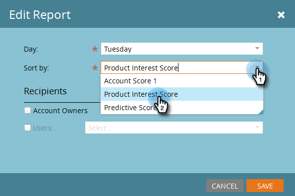
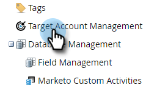
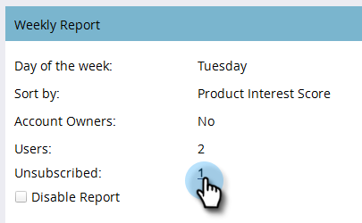
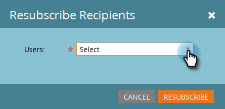
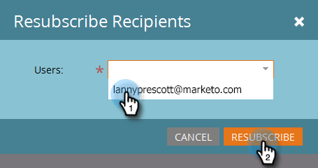

# Configuración de informes TAM {#tam-report-setup}

El informe de ventas de TAM es un correo electrónico semanal personalizado que se envía al equipo de la cuenta.

## Configuración de informes {#report-setup}

1. Haga clic en **[!UICONTROL Administrador]**.

   

1. Haga clic en **[!UICONTROL Administración de cuenta de Target]**.

   

1. En [!UICONTROL Informe semanal], haga clic en **[!UICONTROL Editar]**.

   

1. Haga clic en el menú desplegable **[!UICONTROL Día]** y seleccione el día de la semana en el que desea que los destinatarios reciban el correo electrónico.

   

1. Para determinar el diseño del correo electrónico, haga clic en la lista desplegable **[!UICONTROL Ordenar por]** y realice una selección.

   

1. Marque la casilla de verificación **[!UICONTROL Usuarios]**, luego haga clic en la lista desplegable y seleccione a quién desea recibir el correo electrónico.

   

   >[!NOTE]
   >
   >Las notificaciones solo se enviarán a los propietarios de la cuenta o a los integrantes del equipo.

1. Haga clic en **[!UICONTROL Guardar]**.

   

## Cómo cancelar la suscripción {#how-to-unsubscribe}

Cada informe incluye la opción de exclusión. Para ello, simplemente haga clic en **[!UICONTROL Cancelar la suscripción]** en la parte inferior del correo electrónico.

## Cómo volver a suscribirse {#how-to-resubscribe}

1. Haga clic en **[!UICONTROL Administrador]**.

   

1. Haga clic en **[!UICONTROL Administración de cuenta de Target]**.

   

1. En [!UICONTROL Informe semanal], haga clic en el número que aparece como [!UICONTROL Cancelada la suscripción].

   

1. Haga clic en la lista desplegable **[!UICONTROL Usuarios]**.

   

1. Vuelva a seleccionar el usuario que desea que reciba correos electrónicos y haga clic en **[!UICONTROL Volver a suscribirse]**.

   
