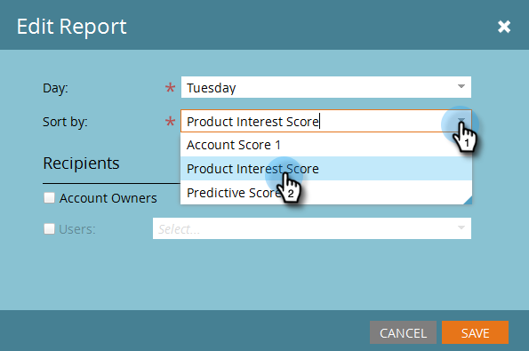

# Configuración del informe TAM {#tam-report-setup}

El informe de ventas de TAM es un correo electrónico personalizado y semanal que se envía al equipo de la cuenta.

## Configuración de informes {#report-setup}

1. Haga clic en **Administrador**.

   

1. Haga clic en **Administración de cuentas de Target**.

   

1. En Informe semanal, haga clic en **Editar**.

   

1. Haga clic en el **Día** y seleccione el día de la semana en el que desea que los destinatarios reciban el correo electrónico.

   

1. Para determinar el diseño del correo electrónico, haga clic en el botón **Ordenar por** y realice una selección.

   

1. Marque la **Usuarios** , haga clic en la lista desplegable y seleccione quién desea recibir el correo electrónico.

   

   >[!NOTE]
   >
   >Las notificaciones solo se enviarán a los propietarios de cuentas o a los integrantes del equipo.

1. Haga clic en **Guardar**.

   

¡Y eso es todo!

## Cómo cancelar la suscripción {#how-to-unsubscribe}

Cada informe incluye la opción de exclusión. Para ello, haga clic en **Cancelar suscripción** en la parte inferior del correo electrónico.

## Cómo volver a suscribirse {#how-to-resubscribe}

1. Haga clic en **Administrador**.

   

1. Haga clic en **Administración de cuentas de Target**.

   

1. En Informe semanal, haga clic en el número que aparece como Cancelación de suscripción.

   

1. Haga clic en el **Usuarios** lista desplegable.

   

1. Seleccione de nuevo el usuario al que desea recibir los correos electrónicos y haga clic en **Volver a suscribirse**.

   
