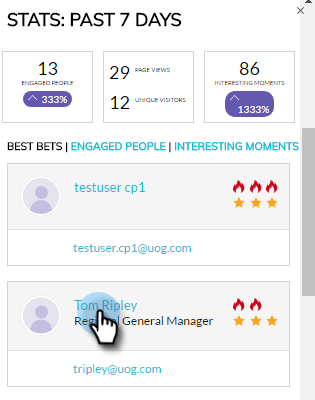

# Información general del complemento de Insight de la cuenta {#account-insight-plug-in-overview}

Account Insight es un complemento de Chrome que muestra datos de cuentas y TAM procesables a sus equipos de ventas, lo que les permite interactuar con cuentas de forma más eficaz.

>[!AVAILABILITY]
>
>La perspectiva de la cuenta se incluye para todos los clientes que tienen perspectivas de ventas de TAM y de Marketo. Para los clientes que solo tienen TAM, Account Insight está disponible como complemento comprado. Cada cliente está limitado a 250 asientos de Account Insight. Póngase en contacto con su representante de ventas para obtener más información. No está disponible para los clientes que no tienen TAM.

>[!CAUTION]
>
>El complemento Perspectiva de la cuenta no funcionará en suscripciones que tengan [SSO-only](/help/marketo/product-docs/administration/additional-integrations/restrict-user-login-to-sso-only.md) habilitado (inicio de sesión único).
>
>El contexto de CRM funciona para Salesforce al iniciar el complemento desde una cuenta, posible cliente o contacto. El contexto de CRM no funcionará para Dynamics al iniciar el complemento desde una cuenta, un posible cliente o un contacto. Para los usuarios de Dynamics, se recomienda utilizar el complemento Perspectiva de la cuenta .

## Cuentas con nombre {#named-accounts}

Consulte las cuentas con nombre en orden de clasificación entre sí. Esta lista solo está disponible para los propietarios de cuentas. El equipo de asistencia de la cuenta estará disponible próximamente.

Para ver los detalles de una cuenta con nombre, haga clic en su nombre...

...y aparece la descripción general.

Vea momentos interesantes usando la lista desplegable.

Desplácese hacia abajo para ver las mejores apuestas. También hay momentos interesantes aquí, junto con gente comprometida.

Haga clic en el nombre de una persona...

...y ver su actividad.

También puede cambiar la vista de Participación a Canalización.

Para salir de la cuenta con nombre, haga clic en la X en la esquina superior derecha.

## Fuente de actividades {#activity-feed}

La fuente de actividad muestra la actividad reciente, que se remonta a siete días.

Haga clic en la lista desplegable **Filter** para filtrar por diferentes tipos de actividades.

Se puede hacer clic en varios artículos. Haga clic en la cuenta con nombre para ver sus detalles. Haga clic en el nombre del usuario para ver su actividad. Haga clic en Más actividades para ver más actividades.

¡Muy bien!

>[!MORELIKETHIS]
>
>[Configurar la perspectiva de la cuenta](/help/marketo/product-docs/target-account-management/setup-tam/set-up-account-insight.md)
