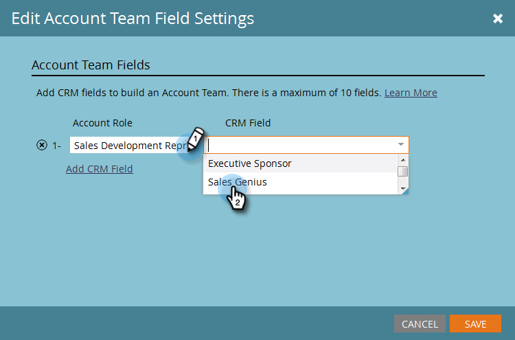

# Configuración del equipo de cuenta {#account-team-setup}

Un equipo de cuenta es un grupo de partes interesadas que trabajan juntas en una cuenta con nombre. Siga estos pasos para elegir qué funciones de cuenta de CRM se deben agregar.

1. Haga clic en **Admin**.

   

1. Haga clic en **ABM**.

   

1. En Miembros del equipo de la cuenta, haga clic en **Editar**.

   

   >[!NOTE]
   >
   >En Función de cuenta, asígnele un nombre y asígnelo al campo de búsqueda de usuario deseado en su CRM.

1. Escriba el nombre de la función de la cuenta y seleccione el campo **CRM**. Añada hasta 10.

   

   >[!NOTE]
   >
   >No puede seleccionar Propietario de la cuenta. Se elige de forma predeterminada desde el nivel de cuenta en su CRM.

1. Haga clic en **Guardar** cuando termine.

   

   >[!CAUTION]
   >
   >Si realiza una actualización, puede que los cambios tarden algún tiempo en reflejarse en ABM.

   >[!NOTE]
   >
   >Cuando se fusionen varias cuentas CRM con diferentes propietarios de cuentas en una cuenta con nombre, Marketo seleccionará un &quot;Propietario de la cuenta&quot; y agregará otros propietarios de cuentas como &quot;Copropietarios de cuentas&quot;.
   >
   >Si posteriormente se cambia el nombre o se elimina un campo &quot;Función&quot; de CRM, Marketo ABM dejará de sincronizar los valores actualizados hasta que el usuario actualice manualmente la configuración en ABM
