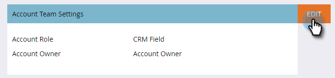

# Ajustes del equipo de cuentas {#account-team-setup}

Un equipo de cuenta es un grupo de partes interesadas que trabajan juntas en una cuenta con nombre. Siga estos pasos para elegir qué funciones de cuenta de CRM se deben agregar.

1. Haga clic en **[!UICONTROL Administrador]**.

   

1. Haga clic en **[!UICONTROL Administración de cuenta de Target]**.

   

1. En Integrantes del equipo de cuenta, haga clic en **[!UICONTROL Editar]**.

   

   >[!NOTE]
   >
   >Para [!UICONTROL Rol de cuenta], asígnele un nombre y haga coincidir con el campo de búsqueda de usuario deseado en su CRM.

1. Escriba su nombre de [!UICONTROL Rol de cuenta] y seleccione el campo **CRM**. Añada hasta 10.

   

   >[!NOTE]
   >
   >No puede seleccionar [!UICONTROL Propietario de la cuenta]. Se elige de forma predeterminada desde el nivel de cuenta en su CRM.

1. Haga clic en **[!UICONTROL Guardar]** cuando termine.

   

   >[!CAUTION]
   >
   >Si realiza una actualización, los cambios pueden tardar un poco en reflejarse en TAM.

   >[!NOTE]
   >
   >* Cuando se combinan varias cuentas de CRM con diferentes propietarios de cuenta en una cuenta con nombre, Marketo elegirá un &quot;Propietario de cuenta&quot; y agregará otros propietarios de cuenta como &quot;Copropietarios de cuenta&quot;
   >
   >* Si más adelante se cambia el nombre de un campo &quot;Rol&quot; de CRM o se elimina, Marketo TAM dejará de sincronizar los valores actualizados hasta que el usuario actualice manualmente la configuración en TAM
