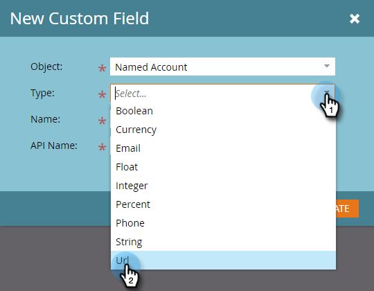
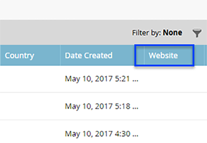

# Creación de un campo personalizado para la detección de CRM {#create-a-custom-field-for-crm-discovery}

Agregue campos personalizados a cuentas, asígnelos a su CRM y utilícelos para la detección de cuentas de CRM en Marketo.

1. Haga clic en **Administrador**.

   

1. Haga clic en **Gestión de las actividades sobre el terreno**, luego **Nuevo campo personalizado**.

   

1. Haga clic en el **Objeto** y seleccione **Cuenta con nombre**.

   

1. Haga clic en el **Tipo** y seleccione un tipo.

   

1. Escriba un **Nombre** (el nombre de la API se rellenará automáticamente) y haga clic en **Crear**.

   

1. Una vez creado el campo, selecciónelo en el árbol de la derecha. Haga clic en el **Acciones de campo** y seleccione **Asignar al campo CRM**.

   

1. Seleccione el campo de cuenta CRM al que desee asignar y haga clic en **Guardar**.

   

   Una vez sincronizado, el nuevo campo aparecerá en el extremo derecho de la cuadrícula de Discover CRM.

   
