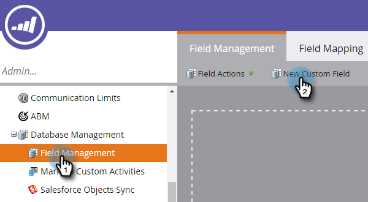
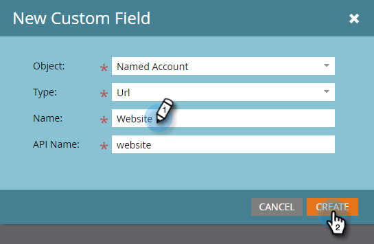

# Crear un campo personalizado para la detección de CRM {#create-a-custom-field-for-crm-discovery}

Agregue campos personalizados a las cuentas, asígnelos a su CRM y úselos para la detección de cuentas de CRM en Marketo.

1. Haga clic en **[!UICONTROL Administrador]**.

   

1. Haga clic en **[!UICONTROL Administración de campos]** y luego en **[!UICONTROL Nuevo campo personalizado]**.

   

1. Haga clic en el menú desplegable **[!UICONTROL Objeto]** y seleccione **[!UICONTROL Cuenta con nombre]**.

   

1. Haga clic en el menú desplegable **[!UICONTROL Tipo]** y seleccione un tipo.

   

1. Escriba un **[!UICONTROL Nombre]** (el Nombre de la API se rellenará automáticamente) y haga clic en **[!UICONTROL Crear]**.

   

1. Una vez creado el campo, selecciónelo en el árbol de la derecha. Haga clic en el menú desplegable **[!UICONTROL Acciones de campo]** y seleccione **[!UICONTROL Asignar a campo CRM]**.

   

1. Seleccione el campo de cuenta de CRM al que desee asignar y haga clic en **[!UICONTROL Guardar]**.

   

   Una vez sincronizado, el nuevo campo aparecerá en el extremo derecho de la cuadrícula de Discover CRM.

   
