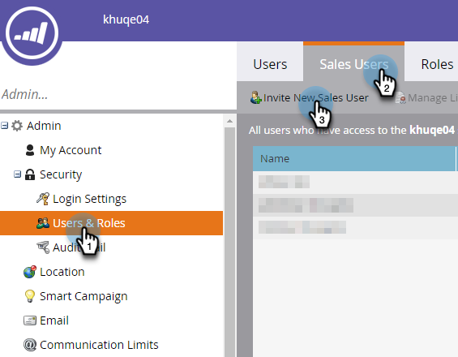
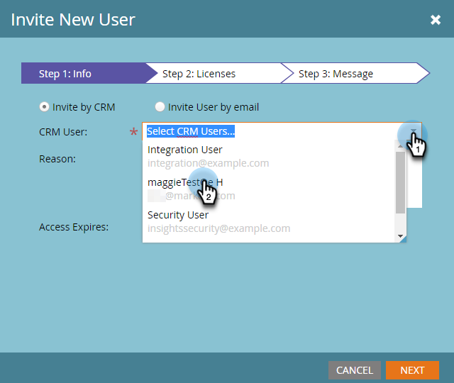
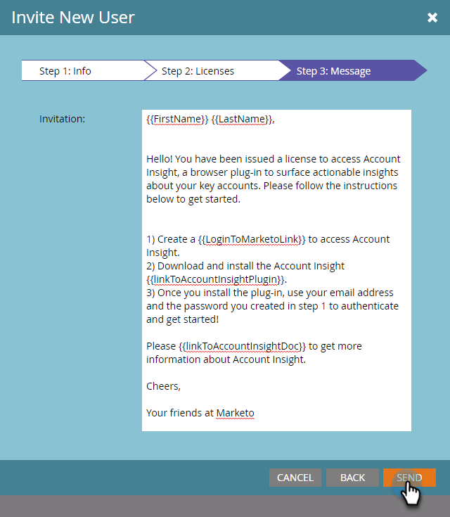

# Invitar a usuarios a acceder a [!UICONTROL Insight de cuenta] {#invite-users-to-access-account-insight}

Siga estos pasos para proporcionar a los usuarios acceso a [!UICONTROL Account Insight].

1. Haga clic en **[!UICONTROL Administrador]**.

   

1. Haga clic en **[!UICONTROL Usuarios y funciones]** en el árbol. A continuación, haga clic en la ficha **[!UICONTROL Usuarios de ventas]** e **[!UICONTROL Invitar a nuevo usuario de ventas]**.

   

   Existen dos formas de invitar a los usuarios: por CRM o por correo electrónico. En este ejemplo utilizaremos Invitar por CRM.

   >[!NOTE]
   >
   >Al invitar a usuarios nuevos (que no sean de Marketo) a través de la lista de usuarios de CRM, puede invitar a varias personas a la vez. La invitación por correo electrónico es 1 para 1.

1. Haga clic en el menú desplegable **[!UICONTROL Usuario de CRM]** y seleccione el usuario que desee.

   

   >[!NOTE]
   >
   >Si elige **[!UICONTROL Invitar al usuario por correo electrónico]**, simplemente ingrese su nombre, apellidos y dirección de correo electrónico y continúe con el paso 4.

1. Para establecer una fecha de caducidad para el acceso del usuario (opcional), haga clic en el icono del calendario. De forma predeterminada, se establece en &quot;nunca&quot;.

   

1. Haga clic en **[!UICONTROL Next]**.

   

1. Marque la casilla de verificación **[!UICONTROL Insight de la cuenta]** y haga clic en **[!UICONTROL Siguiente]**.

   

1. Busque el mensaje enviado, realice los cambios que desee (opcional) y haga clic en **[!UICONTROL Enviar]**.

   
