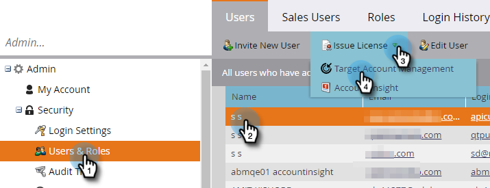

# Expedir una licencia {#issue-a-license}

Tendrá que configurar usuarios con una licencia para utilizar TAM. Así es como se hace.

>[!NOTE]
>
>El número de licencias disponibles variará en función de la suscripción. Si necesita más información, póngase en contacto con su representante de ventas.

1. Haga clic en **[!UICONTROL Administrador]**.

   

1. Haga clic en **[!UICONTROL Usuarios y funciones]**. Seleccione el usuario al que se emitirá la licencia, haga clic en el menú desplegable **[!UICONTROL Emitir licencia]** y seleccione **[!UICONTROL Administración de cuentas de Target]**.

   

1. Marque la casilla de verificación **[!UICONTROL Habilitar licencia]** y haga clic en **[!UICONTROL Guardar]**.

   

   >[!NOTE]
   >
   >Para quitar la licencia de un usuario, sigue el paso 1, desmarca la casilla de verificación y haz clic en **[!UICONTROL Guardar]**.
