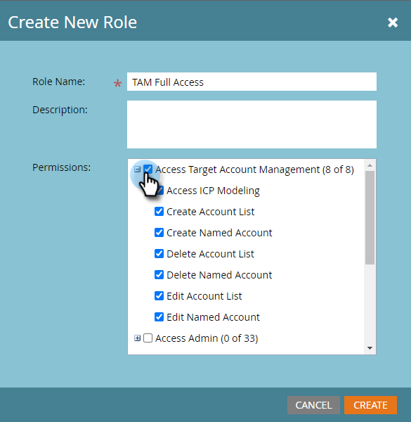

# Permisos {#permissions}

Deberá configurar permisos para que los usuarios puedan utilizar TAM. Así es como.

1. Haga clic en **Admin**.

   

1. Haga clic en **Usuarios y funciones**.

   

   >[!NOTE]
   >
   >Puede añadir permisos TAM para una función existente o crear una completamente nueva. Este ejemplo utiliza una función nueva.

1. Haga clic en **Roles** y luego en **Nuevo rol**.

   

1. Introduzca un Nombre de función y haga clic en el icono **+** situado junto a la casilla de verificación Access Target Account Management .

   

1. Para seleccionar _todos los permisos_, simplemente marque la casilla **Access Target Account Management**.

   

   >[!NOTE]
   >
   >También tiene la opción de seleccionar solo algunas de las opciones. Para ello, marque cada casilla de verificación individualmente.

1. Haga clic en **+** para abrir el menú Administración de acceso . Marque la casilla **Access ABM Admin** (ABM es el nombre anterior para TAM) y haga clic en **Create**.

   

   Su nueva función TAM ya está lista para [asignarse a un usuario](/help/marketo/product-docs/administration/users-and-roles/managing-user-roles-and-permissions.md#assign-roles-to-a-user)!
