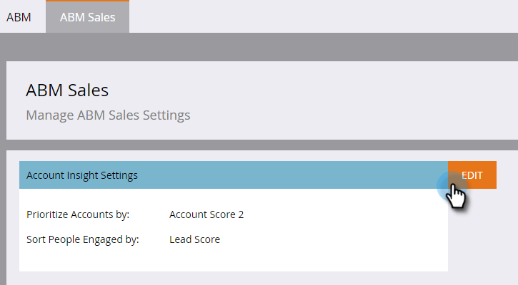

# Configurar la perspectiva de la cuenta {#set-up-account-insight}

Así es como configurar la perspectiva de cuenta.

>[!PREREQUISITES]
>
>La puntuación de la cuenta ABM [debe configurarse](/help/marketo/product-docs/target-account-management/setup-tam/account-score.md) primero.

1. Haga clic en **Admin**.

   

1. Haga clic en **ABM** en el árbol y luego en la pestaña **ABM Sales**.

   

1. Haga clic en **Editar**.

   

1. Haga clic en los menús desplegables para elegir cómo la perspectiva de cuenta prioriza las cuentas con nombre y las personas comprometidas.

   

   >[!NOTE]
   >
   >Si los [ajustes de la puntuación de cuenta](/help/marketo/product-docs/target-account-management/setup-tam/account-score.md) se actualizan en cualquier momento, un administrador debe actualizar la configuración en Ventas ABM para asegurarse de que las puntuaciones reflejen con precisión las preferencias del usuario. El usuario debe cerrar la sesión y volver a iniciarla para ver los cambios.

1. Haga clic en **Guardar**.

   
