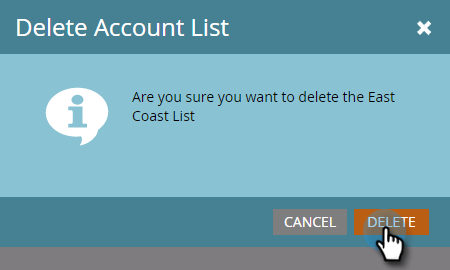

# Listas de cuentas {#account-lists}

Una lista de cuentas es una colección de cuentas con nombre que se pueden dirigir juntas. Las listas de cuentas le permiten dirigirse a cuentas con nombre según el sector, la ubicación o el tamaño de la empresa.

Además de las listas de cuentas, también puede crear listas de cuentas dinámicas que se generen a partir de las vistas de cuentas públicas de CRM. Una vista de cuenta de CRM es un conjunto de reglas que actúa como filtro cuando se muestran las cuentas. Por ejemplo, puede utilizarla para encontrar cuentas en las que el sector esté al cuidado de la salud *y* Los ingresos superan los 100 millones de dólares.

>[!NOTE]
>
>Las listas de cuentas creadas en Marketo Target Account Management están disponibles automáticamente al crear listas inteligentes y campañas web en [Personalización web](/help/marketo/product-docs/web-personalization/using-web-segments/web-segments.md).

## Crear una nueva lista de cuentas {#create-a-new-account-list}

1. Haga clic en el **Nuevo** y seleccione **Crear nueva lista de cuentas**.

   

1. Asigne un nombre a la lista y haga clic en **Crear**.

   

1. Después de crear la lista de cuentas, comience con [adición de cuentas con nombre](/help/marketo/product-docs/target-account-management/target/named-accounts/add-an-existing-named-account-to-an-account-list.md)!

   >[!NOTE]
   >
   >Marketo solo mostrará perspectivas para listas de cuentas con 2000 o menos cuentas con nombre.

## Crear una nueva lista de cuentas dinámicas {#create-a-new-dynamic-account-list}

1. Haga clic en el **Nuevo** y seleccione **Crear nueva lista dinámica**.

   

1. En el cuadro de diálogo, seleccione una **Vista de cuenta de CRM** en la lista desplegable o escriba el nombre para buscarlo.

   

1. Haga clic en **Crear**.

   

   >[!NOTE]
   >
   >En Salesforce, asegúrese de proporcionar permisos de objeto de vista de lista al usuario de sincronización.

## Cambiar el nombre de una lista de cuentas {#rename-an-account-list}

>[!NOTE]
>
>Estos pasos solo se aplican a listas de cuentas. _Dinámica_ las listas de cuentas utilizan el nombre de sus vistas de cuenta de CRM asociadas.

1. Seleccione la cuenta a la que desee cambiar el nombre y haga clic en el botón **Acciones de lista de cuentas** y seleccione **Cambiar el nombre de la lista de cuentas**.

   

1. Introduzca el nuevo nombre y haga clic en **Cambiar nombre**.

   

   >[!NOTE]
   >
   >La vista de cuenta de CRM se sincroniza con la lista de cuentas dinámicas cada 8 horas. Si aún no se han sincronizado, Marketo los sincronizará durante el siguiente ciclo.

## Eliminar una lista de cuentas {#delete-an-account-list}

>[!NOTE]
>
>Estos pasos son los mismos para listas de cuentas y listas de cuentas dinámicas.

1. Seleccione la cuenta que desee eliminar y haga clic en el botón **Acciones de lista de cuentas** y seleccione **Eliminar lista de cuentas**.

   

1. Haga clic en **Eliminar**.

   

>[!MORELIKETHIS]
>
>* [Agregar una cuenta con nombre existente a una lista de cuentas](/help/marketo/product-docs/target-account-management/target/named-accounts/add-an-existing-named-account-to-an-account-list.md)
>* [Información de la lista de cuentas](/help/marketo/product-docs/target-account-management/measure/account-list-insights.md)

