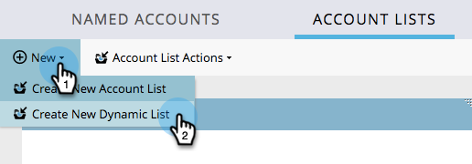

# Listas de cuentas {#account-lists}

Una lista de cuentas es una colección de cuentas con nombre que se pueden agrupar como destino. Las listas de cuentas le permiten segmentar cuentas con nombre por sector, ubicación o tamaño de la compañía.

Además de las listas de cuentas, también puede crear listas de cuentas dinámicas que se generan a partir de vistas de cuentas de CRM públicas. Una vista de cuenta de CRM es un conjunto de reglas que actúa como filtro al mostrar cuentas. Por ejemplo, puede utilizarlo para buscar cuentas donde la industria sea la sanidad *y* Los ingresos superan los 100 millones de dólares.

>[!NOTE]
>
>Las listas de cuentas creadas en Marketo Target Account Management están disponibles automáticamente al crear listas inteligentes y campañas web en [Personalización web](/help/marketo/product-docs/web-personalization/using-web-segments/web-segments.md).

## Crear una nueva lista de cuentas {#create-a-new-account-list}

1. Haga clic en **Nuevo** y seleccione. **Crear nueva lista de cuentas**.

   

1. Asigne un nombre a la lista y haga clic en **Crear**.

   

1. Después de crear la lista de cuentas, comience con [adición de cuentas con nombre](/help/marketo/product-docs/target-account-management/target/named-accounts/add-an-existing-named-account-to-an-account-list.md)!

   >[!NOTE]
   >
   >Marketo solo mostrará perspectivas para listas de cuentas con 2000 cuentas con nombre o menos.

## Crear una nueva lista de cuentas dinámicas {#create-a-new-dynamic-account-list}

1. Haga clic en **Nuevo** y seleccione. **Crear nueva lista dinámica**.

   

1. En el cuadro de diálogo, seleccione una **Vista de cuenta CRM** en la lista desplegable o escriba el nombre para buscarlo.

   

1. Haga clic en **Crear**.

   

   >[!NOTE]
   >
   >En Salesforce, asegúrese de proporcionar permisos de objeto de vista de lista al usuario de sincronización.

## Cambiar nombre de lista de cuentas {#rename-an-account-list}

>[!NOTE]
>
>Estos pasos solo se aplican a listas de cuentas. _Dinámico_ Las listas de cuentas de utilizan el nombre de sus vistas de cuentas de CRM asociadas.

1. Seleccione la cuenta cuyo nombre desea cambiar, haga clic en el botón **Acciones de lista de cuenta** y seleccione. **Cambiar nombre de lista de cuentas**.

   

1. Introduzca el nuevo nombre y haga clic en **Cambiar nombre**.

   

   >[!NOTE]
   >
   >La vista de cuenta de CRM se sincroniza con la lista de cuentas dinámicas cada 8 horas. Si aún no están sincronizados, Marketo los sincronizará durante el siguiente ciclo.

## Eliminar una lista de cuentas {#delete-an-account-list}

>[!NOTE]
>
>Estos pasos son los mismos para las listas de cuentas y las listas de cuentas dinámicas.

1. Seleccione la cuenta que desee eliminar y haga clic en **Acciones de lista de cuenta** y seleccione. **Eliminar lista de cuentas**.

   

1. Clic **Eliminar**.

   

>[!MORELIKETHIS]
>
>* [Agregar una cuenta con nombre existente a una lista de cuentas](/help/marketo/product-docs/target-account-management/target/named-accounts/add-an-existing-named-account-to-an-account-list.md)
>* [Account List Insights](/help/marketo/product-docs/target-account-management/measure/account-list-insights.md)
