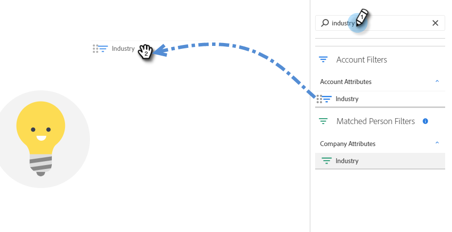
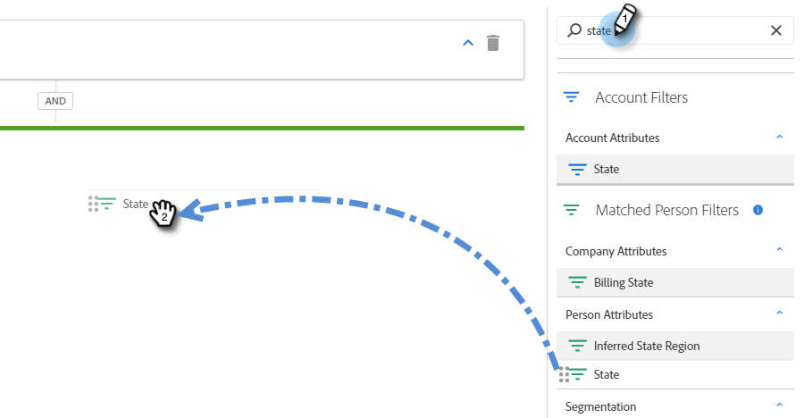
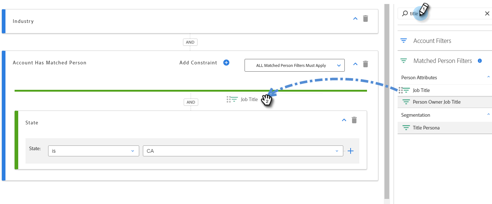

# Listas inteligentes de cuenta {#account-smart-lists}

A continuación se muestra cómo identificar de forma rápida y precisa sus cuentas de alto valor.

>[!NOTE]
>
>Esta función solo está disponible para aquellos que tengan el complemento Administración de cuentas de Target y una licencia de TAM emitida.

## Crear una lista inteligente de cuentas {#create-an-account-smart-list}

1. En Marketo, vaya a **Marketing Activities**.

   

1. Busque y seleccione el programa que desee.

   

1. Haga clic en la lista desplegable **New** y seleccione **New Local Asset**.

   

1. Haga clic en **Lista inteligente de cuentas**.

   

1. Introduzca un nombre y haga clic en **Create** (la descripción y las etiquetas son opcionales).

   

Se ha creado la lista inteligente de cuentas. Consulte a continuación los pasos para definir sus reglas.

## Reglas de lista inteligente de cuentas {#account-smart-list-rules}

Las listas inteligentes de cuentas funcionan de manera similar a las listas inteligentes estándar, con una excepción notable: contenedores.

1. Para definir la lista inteligente de cuentas, haga clic en la pestaña **Reglas de lista inteligente de cuentas**.

   

1. Elija los filtros de cuenta que desee. En este ejemplo elegimos _El sector es el sector sanitario_.

   

   

1. Elija los filtros de persona coincidentes. En este ejemplo elegimos _State is California_.

   

**Paso** opcional: Aquí es donde entran los contenedores. Si elige un filtro adicional de persona coincidente, puede soltarlo debajo del primero o _en_, creando un contenedor. En este ejemplo estamos creando un contenedor añadiendo _El título de trabajo es CFO_.

Así se verá el contenedor.

>[!NOTE]
>
>Al crear un contenedor de filtros, se crea una regla &quot;y&quot;, lo que significa que solo devolverá todos los resultados combinados. En este ejemplo, cuentas con una industria de salud, junto con estar ubicados en California _y_ con alguien que aparece como CFO. Si no desea utilizar contenedores, simplemente suelte el filtro debajo o encima del existente.

¡Y eso es todo! Consulte la siguiente sección para ver cómo puede aprovechar su Lista inteligente de cuentas.

>[!TIP]
>
>Al igual que con las listas inteligentes estándar, puede utilizar la lógica avanzada para restringir aún más los resultados. Necesita al menos tres filtros para hacerlo y, en Listas inteligentes de cuenta, un contenedor (independientemente de cuántos filtros contenga) es igual a un filtro.

## Acciones de la lista inteligente de cuentas {#account-smart-list-actions}

En la ficha Información general de la lista inteligente de cuentas, verá algunas opciones de acción.

**Exportar**: Esto exporta los resultados de la lista inteligente de cuentas como CSV.

**Clonar**: Realiza una copia de la lista inteligente de cuentas.

**Enviar a la red** de publicidad: Envía la lista a LinkedIn como una nueva audiencia coincidente.

También puede hacer referencia a su lista inteligente de cuentas en una campaña o lista inteligente estándar utilizando el filtro _People Member of Account Smart List_.

>[!NOTE]
>
>Los resultados de la Lista inteligente Personas de cuenta mostrarán a todas las personas de las cuentas identificadas, no solo a las personas que se encuentran a través de filtros Personas coincidentes en la lista inteligente de cuentas.

>[!NOTE]
>
>**Definición**
>
>**Miembro de la lista inteligente de cuentas**: En este caso, la palabra &quot;miembro&quot; se refiere a la cuenta en sí, por lo que &quot;miembro del pueblo&quot; se refiere a las personas reales (registros de Marketo) de esas cuentas.
