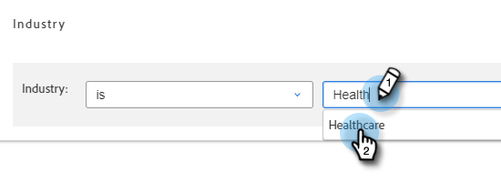

# Listas inteligentes de cuentas {#account-smart-lists}

A continuación se indica cómo identificar de forma rápida y precisa sus cuentas de alto valor.

>[!NOTE]
>
>Esta característica solo está disponible para los que tengan el complemento [!UICONTROL Administración de cuentas de Target] y una licencia TAM emitida.

## Crear una [!UICONTROL lista inteligente de cuentas] {#create-an-account-smart-list}

1. En Marketo, vaya a **[!UICONTROL Actividades de marketing]**.

   

1. Busque y seleccione el programa que desee.

   

1. Haga clic en el menú desplegable **[!UICONTROL Nuevo]** y seleccione **[!UICONTROL Nuevo recurso local]**.

   

1. Haga clic en **[!UICONTROL Lista inteligente de cuentas]**.

   

1. Escriba un nombre y haga clic en **[!UICONTROL Crear]** (la descripción y las etiquetas son opcionales).

   

¡Se ha creado su [!UICONTROL lista inteligente de cuentas]! Consulte a continuación los pasos para definir sus reglas.

## Reglas de la [!UICONTROL lista inteligente de cuentas] {#account-smart-list-rules}

[!UICONTROL Listas inteligentes de cuenta] funcionan de manera similar a las Listas inteligentes estándar, con una excepción notable: los contenedores.

1. Para definir su [!UICONTROL lista inteligente de cuentas], haga clic en la ficha **[!UICONTROL Reglas de lista inteligente de cuentas]**.

   

1. Elija los filtros de cuenta que desee. En este ejemplo elegimos _[!UICONTROL Sector] como [!UICONTROL Sector de atención médica]_.

   

   

   >[!NOTE]
   >
   >Los datos del indicador ICP que se usaron en su [clasificación y ajuste de generación de perfiles de cuenta](/help/marketo/product-docs/target-account-management/account-profiling/account-profiling-ranking-and-tuning.md) aparecerán como Atributos de cuenta personalizados para usarlos en su Lista inteligente de cuentas. Estos datos de atributos personalizados se basan en el momento en el que se creó o actualizó el modelo de perfil de cuenta.

1. Elija su filtro de persona coincidente. En este ejemplo elegimos _El estado es California_.

   

**PASO OPCIONAL**: Aquí es donde entran los contenedores. Si elige un filtro de persona coincidente adicional, puede soltarlo debajo del primero o _en_, creando un contenedor. En este ejemplo creamos un contenedor al agregar _El puesto es CFO_.

Este es el aspecto que tendrá el contenedor.

>[!NOTE]
>
>Al crear un contenedor de filtros, se crea una regla &quot;y&quot;, lo que significa que solo devolverá todos los resultados combinados. En este ejemplo, las cuentas con una industria de la salud, junto con estar ubicado en California _y_ con alguien listado como CFO. Si no desea utilizar contenedores, simplemente suelte el filtro por debajo o por encima del existente.

¡Y eso es todo! Consulte la sección siguiente para ver cómo puede aprovechar su [!UICONTROL lista inteligente de cuentas].

>[!TIP]
>
>Al igual que con las listas inteligentes estándar, puede utilizar la lógica avanzada para restringir aún más los resultados. Necesita al menos tres filtros para hacerlo y en [!UICONTROL Listas inteligentes de cuentas], un contenedor (independientemente de cuántos filtros contenga él mismo) es igual a un filtro.

## [!UICONTROL Acciones de lista inteligente de cuentas] {#account-smart-list-actions}

En la pestaña Información general de tu [!UICONTROL Lista inteligente de cuentas], verás algunas opciones de acción.

**[!UICONTROL Exportar]**: Esto exporta los resultados de su [!UICONTROL lista inteligente de cuentas] como CSV.

**[!UICONTROL Clonar]**: Realiza una copia de tu [!UICONTROL Lista inteligente de cuentas].

**[!UICONTROL Enviar a la red de anuncios]**: envía la lista a [!DNL LinkedIn] como una nueva audiencia coincidente.

También puede hacer referencia a su [!UICONTROL lista inteligente de cuentas] en una campaña o lista inteligente estándar usando el filtro _[!UICONTROL Lista inteligente de miembros de la cuenta de personas]_.

>[!NOTE]
>
>Los resultados de [!UICONTROL Lista inteligente de miembros de la cuenta Personas] mostrarán a todas las personas de las cuentas identificadas, no solo a las personas que se encuentren a través de los filtros de personas coincidentes en la lista inteligente de cuentas.

>[!NOTE]
>
>**Definición**
>
>**[!UICONTROL Lista inteligente de miembros de la cuenta Personas]**: En este caso, la palabra &quot;miembro&quot; hace referencia a la propia cuenta, por lo que &quot;miembro de personas&quot; hace referencia a las personas reales (registros de Marketo) en esas cuentas.
