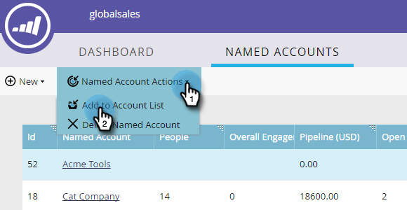

# Agregar una [!UICONTROL cuenta con nombre] existente a una lista de cuentas {#add-an-existing-named-account-to-an-account-list}

Añadir una cuenta con nombre a una lista de cuentas es sencillo.

>[!NOTE]
>
>Esto se aplica solamente a las Listas de cuentas, **no a las Listas de cuentas dinámicas**.

1. Seleccione la fila de la cuenta con nombre a la que desee agregar.

   

1. Haga clic en la lista desplegable **[!UICONTROL Acciones de cuenta con nombre]** y seleccione **[!UICONTROL Agregar a la lista de cuentas]**.

   

1. Haga clic en la lista desplegable **[!UICONTROL Lista de cuentas]**, seleccione la lista de cuentas que desee y haga clic en **[!UICONTROL Agregar]**.

   

>[!MORELIKETHIS]
>
>[Crear una [!UICONTROL cuenta con nombre]](/help/marketo/product-docs/target-account-management/target/named-accounts/create-a-named-account.md)
