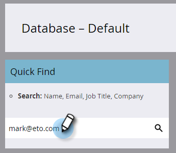

# Agregar personas a una cuenta con nombre {#add-people-to-a-named-account}

Existen tres formas diferentes de agregar manualmente personas a una cuenta con nombre en TAM.

## Acción de flujo único {#single-flow-action}

1. Clic **Base de datos**.

   

1. Introduzca la dirección de correo electrónico de la persona y pulse Intro.

   

1. Haga clic en la persona para seleccionarla. Haga clic en **Acciones de persona** , haga clic en **Marketing** y seleccione **Agregar a cuenta con nombre**.

   

1. Haga clic en **Cuenta con nombre** , seleccione la cuenta con nombre que desee y haga clic en **Ejecutar ahora**.

   

## Etapa de flujo de campaña inteligente {#smart-campaign-flow-step}

1. Seleccione la campaña inteligente y haga clic en **Flujo**.

   

1. En el cuadro de búsqueda, escriba &quot;Agregar a cuenta con nombre&quot;.

   

1. Arrastre el filtro al lienzo.

   

1. Haga clic en **Cuenta con nombre** y seleccione la cuenta con nombre que desee.

   

   ¡Eso es todo! A continuación, simplemente programe (o active) su campaña inteligente y el paso de flujo empezará a agregar personas calificadas a la cuenta con nombre designada.

## Lista de importación {#list-import}

1. Seleccione la lista y haga clic en **Enumerar acciones** y seleccione. **Importar lista**.

   

1. Después de elegir el archivo y la configuración, haga clic en **Siguiente**.

   

1. Asigne los campos deseados. Asegúrese de que la **Cuenta con nombre** el campo está asignado.

   

1. Elija la configuración que desee y haga clic en **Importar**.

   

>[!MORELIKETHIS]
>
>[Coincidencia de cliente potencial con cuenta](/help/marketo/product-docs/target-account-management/target/named-accounts/lead-to-account-matching.md)
