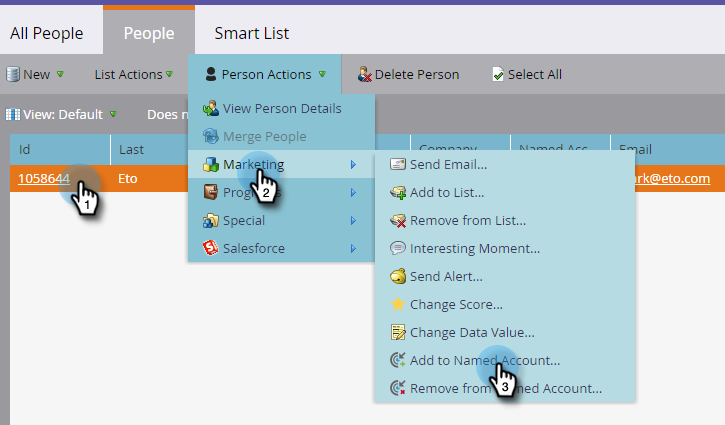

# Agregar personas a una [!UICONTROL cuenta con nombre] {#add-people-to-a-named-account}

Existen tres formas diferentes de agregar manualmente personas a una cuenta con nombre en TAM.

## Acción de flujo individual {#single-flow-action}

1. Haga clic en **[!UICONTROL Base de datos]**.

   

1. Introduzca la dirección de correo electrónico de la persona y pulse Intro.

   

1. Haga clic en la persona para seleccionarla. Haga clic en el menú desplegable **[!UICONTROL Acciones de persona]**, haga clic en **[!UICONTROL Marketing]** y seleccione **[!UICONTROL Agregar a cuenta con nombre...]**.

   

1. Haga clic en la lista desplegable **[!UICONTROL Cuenta con nombre]**, seleccione la [!UICONTROL Cuenta con nombre] que desee y haga clic en **[!UICONTROL Ejecutar ahora]**.

   

## Etapa de flujo de campaña inteligente {#smart-campaign-flow-step}

1. Seleccione su campaña inteligente y haga clic en **[!UICONTROL Flujo]**.

   

1. En el cuadro de búsqueda, escriba &quot;[!UICONTROL Agregar a la cuenta con nombre]&quot;.

   

1. Arrastre el filtro al lienzo.

   

1. Haga clic en la lista desplegable **[!UICONTROL Cuenta con nombre]** y seleccione la [!UICONTROL Cuenta con nombre] que desee.

   

   ¡Ya está! A continuación, simplemente programe (o active) su campaña inteligente y el paso de flujo empezará a agregar personas calificadas a la cuenta con nombre designada.

## Lista de importación {#list-import}

1. Seleccione su lista, haga clic en la lista desplegable **[!UICONTROL Acciones de lista]** y seleccione **[!UICONTROL Importar lista]**.

   

1. Después de elegir el archivo y la configuración, haga clic en **[!UICONTROL Siguiente]**.

   

1. Asigne los campos deseados. Asegúrese de que el campo **[!UICONTROL Cuenta con nombre]** esté asignado.

   

1. Elija la configuración que desee y haga clic en **[!UICONTROL Importar]**.

   

>[!MORELIKETHIS]
>
>[Coincidencia de cliente potencial con cuenta](/help/marketo/product-docs/target-account-management/target/named-accounts/lead-to-account-matching.md)
