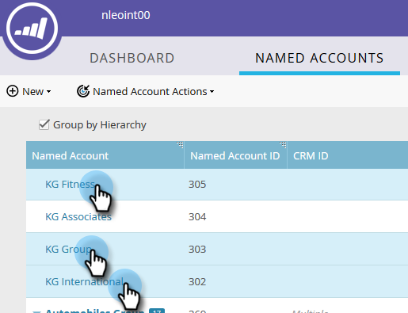

# Crear una jerarquía {#create-a-hierarchy}

Las jerarquías están pensadas para crearse en CRM. Sin embargo, si no tiene un CRM, siga estos pasos para crear una jerarquía manualmente.

1. En Cuentas con nombre, haga clic en **Agrupar por jerarquía** casilla de verificación

   

   >[!NOTE]
   >
   >Solo se pueden utilizar cuentas que no sean de CRM para crear manualmente una jerarquía. Las cuentas vinculadas a CRM deben tener sus jerarquías creadas en CRM.

1. Con Ctrl+clic (Windows) o Cmd+clic (Mac), seleccione todas las cuentas que desee agrupar en una jerarquía.

   

1. Haga clic en **Acciones de cuenta con nombre** y seleccione. **Vincular a cuenta con nombre**.

   

   >[!NOTE]
   >
   >Si desea desvincular cuentas, siga los pasos anteriores y elija **Desvincular de la cuenta con nombre**.

1. Seleccione una cuenta con nombre principal de la lista desplegable y haga clic en **Vínculo**.

   

1. Sus cuentas con nombre ahora forman parte de una jerarquía. Haga clic en la flecha a la izquierda para ver todas sus cuentas secundarias.

   
