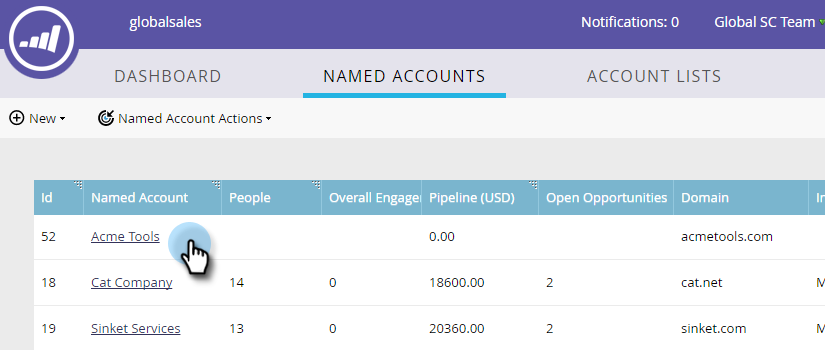

# Eliminar una [!UICONTROL cuenta con nombre] {#delete-a-named-account}

Siga estos pasos rápidos para eliminar una cuenta con nombre.

1. Seleccione la fila de las cuentas con nombre que desee eliminar.

   

   >[!NOTE]
   >
   >Ctrl + clic (Windows) o Cmd + clic (Mac) para seleccionar varias cuentas con nombre.

1. Haga clic en la lista desplegable **[!UICONTROL Acciones de cuenta con nombre]** y seleccione **[!UICONTROL Eliminar cuenta con nombre]**.

   

1. Haga clic en **[!UICONTROL Eliminar]**.

   

   >[!NOTE]
   >
   >Las cuentas que se han sincronizado con su CRM no se pueden eliminar en TAM. Si la opción Eliminar no está disponible, o si recibe el mensaje &quot;Estas cuentas no se pueden eliminar porque se seleccionaron una o más cuentas de CRM&quot;, deben eliminarse directamente en CRM.
