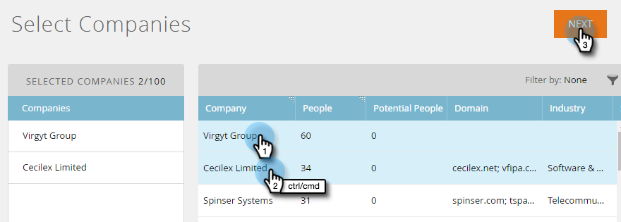

# Cuentas de Discover {#discover-accounts}

Utilice la opción Discover para identificar posibles cuentas objetivo.

## Discover Cuentas CRM {#discover-crm-accounts}

Identifique posibles cuentas de destino desde su CRM.

>[!NOTE]
>
>Después de conectar su CRM a Marketo TAM, **Discover CRM Accounts** mostrará todas las cuentas CRM e información relevante para ayudarlo a elegir las cuentas con nombre correcto. Marketo agrega información adicional además de lo que se recibe de CRM.

**Personas**  (En Cuentas CRM de Discover y Empresas de Discover Marketo): Incluye Contactos y Posibles clientes. Los posibles clientes se pueden descubrir utilizando la [coincidencia de cliente potencial](/help/marketo/product-docs/target-account-management/target/named-accounts/lead-to-account-matching.md) de Marketo.

**Personas Posibles**  (En Cuentas CRM De Discover Y Compañías Marketo De Discover): Muestra cuántos posibles clientes encontrados por Marketo que podrían pertenecer a una cuenta CRM.

**Campo CRM personalizado**  (solo en cuentas CRM de Discover): Esto le ayudará a alinear su organización de ventas y marketing para seleccionar las cuentas de destino correctas. Una vez que [asigne el campo CRM personalizado](/help/marketo/product-docs/target-account-management/setup-tam/create-a-custom-field-for-crm-discovery.md) con Marketo TAM, le mostraremos los datos asignados para ayudarle a identificar sus cuentas de destino.

1. En Cuentas con nombre, haga clic en la lista desplegable **New** y seleccione **Discover CRM Accounts**.

   

1. Se abrirá una nueva ventana o pestaña. Seleccione las cuentas de CRM que desee agregar a sus cuentas con nombre y haga clic en **Siguiente**.

   

1. La pantalla de vista previa confirma la cantidad de selecciones. Haga clic en **Crear**.

   

   ¡Eso es todo!

   

## Discover Marketo Companies {#discover-marketo-companies}

Identifique las empresas adecuadas para la segmentación.

>[!NOTE]
>
>En las empresas de Discover Marketo, verá empresas de Marketo que no provenían de su CRM.

1. En Cuentas con nombre, haga clic en la lista desplegable **New** y seleccione **Discover Marketo Companies**.

   

1. Se abrirá una nueva ventana o pestaña. Seleccione las empresas que desea agregar a sus cuentas con nombre y haga clic en **Siguiente**.

   

   >[!NOTE]
   >
   >En las empresas de Discover Marketo y Discover CRM, Marketo automáticamente:
   >
   >* Encuentra personas de la base de datos de Marketo que tienen esa empresa en la lista de su registro. Si ve varios valores para algunos de los atributos (por ejemplo, Industria), se debe a que Marketo encontró valores diferentes enumerados para esas personas individuales. El atributo con la mayor cantidad de visitas gana
   >
   >Solo en **Discover CRM**, Marketo automáticamente:
   >
   >* Sincroniza y asocia contactos de CRM con la cuenta con nombre
   >
   >Solo en **Compañías de Discover Marketo**, Marketo automáticamente:
   >
   >* Filtra la mayoría de los proveedores de servicios de Internet y los dominios públicos (por ejemplo, yahoo.com, gmail.com) como nombres de compañía
      >
      >
   * Desduplica cuentas de CRM. Si tiene &quot;Acme&quot; en un registro y &quot;Acme Inc&quot; (o cualquiera de los siguientes sufijos: Co, Corp, Corporation, Gmbh, Inc, Incorporated, LLC, LLP, LP, Ltd, PA, PC, PLC, PLLC), los fusionaremos en TAM como simplemente &quot;Acme&quot;.
   >
   >Si desea que Marketo desduplique cuentas por ID de CRM o Propietario de la cuenta en lugar de por Nombre de la empresa, póngase en contacto con [Soporte técnico de Marketo](https://nation.marketo.com/t5/Support/ct-p/Support).

1. Haga clic en la flecha hacia abajo en la columna Cuenta con nombre para mostrar la lista desplegable.

   

   >[!CAUTION]
   >
   >En adelante, cualquier persona nueva de estas empresas seleccionadas se asignará automáticamente a sus cuentas con nombre respectivas. Compruebe estas empresas y asegúrese de que están asignadas a la cuenta con nombre correcta.

1. Para seleccionar una cuenta existente, haga clic en la lista desplegable **Cuenta con nombre**, elija la cuenta que desee y haga clic en **Siguiente**.

   

   También tiene la opción de crear una nueva cuenta con nombre escribiendo el nombre deseado directamente en el cuadro desplegable. Haga clic fuera de la casilla cuando termine...

   

   ...y verá su nueva cuenta con nombre. En ese punto, haga clic en **Next** como en el paso 4.

   

1. Haga clic en **Crear**.

   

   ¡Buen trabajo!

   

>[!NOTE]
>
>Si ve una discordancia entre las cuentas de CRM que ha seleccionado y lo que hay en la cuadrícula de CRM de Discover, es probable que se deba a una o más de las siguientes razones:
>
>* Tener diferentes cuentas CRM con nombres similares que se deduplicaron
>* Aún no se ha producido la siguiente sincronización programada

>[!MORELIKETHIS]
>
>[Coincidencia de posibles clientes con cuentas](/help/marketo/product-docs/target-account-management/target/named-accounts/lead-to-account-matching.md)
