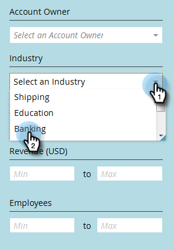

# Filtrado en [!UICONTROL cuentas con nombre] {#filtering-in-named-accounts}

El filtrado es una buena manera de reducir los datos rápidamente.

>[!NOTE]
>
>Los datos de los desplegables de filtros reflejan todos los campos disponibles en su CRM que se han sincronizado con Marketo.

1. Haga clic en el icono de filtro.

   

   >[!NOTE]
   >
   >Existen varias combinaciones de parámetros de búsqueda. En este ejemplo ubicamos: _[!UICONTROL Industria] = Bancaria, [!UICONTROL País] = Estados Unidos, Máximo de [!UICONTROL Empleados] = 10000_.

1. Haga clic en el menú desplegable **[!UICONTROL Sector]** y seleccione **[!UICONTROL Bancos]**.

   

1. Haga clic en el menú desplegable **[!UICONTROL País]** y seleccione **[!UICONTROL Estados Unidos]**.

   

1. En **[!UICONTROL Empleados]**, escriba &quot;0&quot; en el campo **Mín.**, &quot;10000&quot; en el campo **Máx.** y, a continuación, haga clic en **[!UICONTROL Aplicar]**.

   

   Los resultados filtrados aparecen en la parte izquierda de la pantalla.

   >[!NOTE]
   >
   >Para agregar más filtros para elegir, haga clic en **[!UICONTROL Agregar filtro]** en la parte inferior izquierda del formulario.
