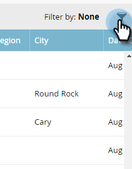

# Filtrado en cuentas con nombre {#filtering-in-named-accounts}

El filtrado es una buena manera de reducir los datos rápidamente.

>[!NOTE]
>
>Los datos de las listas desplegables de filtros reflejan todos los campos disponibles en su CRM que se han sincronizado con Marketo.

1. Haga clic en el icono de filtro.

   

   >[!NOTE]
   >
   >Hay varias combinaciones de parámetros de búsqueda. En este ejemplo se encuentra: _Industria = Banca, País = Estados Unidos, Máximo de empleados = 10000_.

1. Haga clic en el **Industria** y seleccione **Banca**.

   

1. Haga clic en el **País** y seleccione **Estados Unidos**.

   

1. En **Empleados**, escriba &quot;0&quot; en la **Min** , &quot;10000&quot; en la variable **Max** y, a continuación, haga clic en **Aplicar**.

   

   ¡Y eso es todo! Los resultados filtrados aparecen en la parte izquierda de la pantalla.

   >[!NOTE]
   >
   >Para añadir más filtros para elegir, haga clic en **Agregar filtro** en la parte inferior izquierda del formulario.
