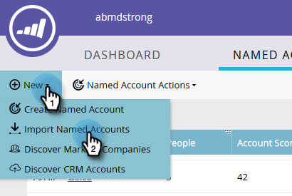

# Importar cuentas con nombre {#import-named-accounts}

¿Ya tiene un CSV lleno de posibles cuentas de destino? Importarlos directamente en TAM!

1. Haga clic en la lista desplegable **New** y seleccione **Import Named Accounts**.

   

1. Se abrirá una nueva ventana. Haga clic en **Examinar** y, a continuación, seleccione el archivo de cuentas con nombre que desee importar.

   

   >[!TIP]
   >
   >En el archivo, proporcione [tanta información](/help/marketo/product-docs/target-account-management/target/named-accounts/named-account-overview.md#named-account-attributes) como sea posible. Solo se puede añadir información fotográfica; nada calcula Marketo (es decir, Canalización). Para crear cuentas con nombre basadas en cuentas CRM, simplemente exporte el nombre de cuenta y el ID de CRM desde su CRM a un archivo CSV, utilice la opción Nombre de cuenta y asigne el ID de CRM durante el proceso de importación. Para vincular correctamente una cuenta de CRM a una cuenta con nombre, debe proporcionar el nombre exacto de la cuenta de CRM.

1. Elija entre dos modos de desduplicación: Nombre de cuenta o nombre de dominio. En este ejemplo elegiremos Cuenta. Haga clic en la lista desplegable **Modes** y seleccione **By Account Name**.

   

   >[!NOTE]
   >
   >Si elige **Por modo de dominio**, se deben incluir tanto los campos de cuenta con nombre como los de dominio.

1. Para elegir a qué lista de cuentas se añade su cuenta con nombre, haga clic en la lista desplegable **Cuenta** y realice la selección.

   

   >[!NOTE]
   >
   >También puede crear una nueva lista de cuentas simplemente escribiendo su nombre en el cuadro desplegable.

1. Para enviar una notificación de la importación, haga clic en la lista desplegable **Send Alert To** y seleccione un usuario de Marketo. _no puede_ introducir manualmente una dirección de correo electrónico.

   

1. Haga clic en **Siguiente**.

   

1. Para asignar cada campo, haga doble clic en la lista desplegable **Marketo Field** y seleccione el campo apropiado. Haga clic en **Siguiente** cuando termine.

   

   ¡Correcto!

   

   >[!NOTE]
   >
   >&quot;Comprobar estado de importación&quot; solo muestra los últimos tres días de actividad.

Escenarios en los que desduplica por nombre de cuenta:

<table> 
 <tbody> 
  <tr> 
   <td><strong>Importación de registros con el nombre de cuenta con nombre existente</strong></td> 
   <td>
Actualizaremos el registro existente
</td> 
  </tr> 
  <tr> 
   <td><strong>Importación de registros con el nuevo nombre de cuenta con nombre</strong></td> 
   <td>Crearemos un nuevo registro</td> 
  </tr> 
 </tbody> 
</table>

Escenarios en los que desduplica por nombre de dominio:

<table> 
 <tbody> 
  <tr> 
   <td><strong>Importación de registros con un nuevo nombre de cuenta y un nuevo nombre de dominio</strong></td> 
   <td>Crearemos una nueva cuenta con nombre con la información proporcionada</td> 
  </tr> 
  <tr> 
   <td><strong>Importación de registros con un nombre de cuenta existente y un nombre de dominio existente</strong></td> 
   <td>Actualizaremos la cuenta con nombre existente</td> 
  </tr> 
   <tr> 
   <td><strong>Importación de registros con un nuevo nombre de cuenta y un nombre de dominio existente</strong></td> 
   <td>Anexaremos el nuevo nombre de cuenta a la cuenta con nombre existente que coincida con el nombre de dominio y actualizaremos otra información (por ejemplo, sector, estado, etc.)</td> 
  </tr> 
  <tr> 
   <td><strong>Importación de registros con el nombre de cuenta con nombre existente y el nuevo nombre de dominio</strong></td> 
   <td>Anexaremos el nuevo nombre de dominio a la cuenta con nombre existente que coincida con el nombre de la cuenta y actualizaremos otra información (por ejemplo, sector, estado, etc.)</td> 
  </tr> 
 </tbody> 
</table>

>[!NOTE]
>
>Cuando Marketo añade una cuenta con nombre, se actualiza una regla (entre bastidores) que nos permite identificar a las personas que deberían formar parte de la cuenta con nombre. Ejemplo: si actualiza &quot;IBM&quot; a &quot;IBM, EE.UU.&quot;, las personas con cualquiera de los nombres de la empresa se asociarán a la cuenta con nombre.

Si Marketo encuentra registros que vemos como duplicados, solo procesaremos el primero.
