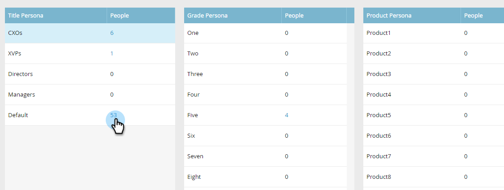

# Uso de personalidades {#using-personas}

Las personas son una buena manera de segmentar su audiencia de ABM y comercializar con un subconjunto específico de personas.

## Añadir una persona {#add-a-persona}

1. En Mi Marketo, haga clic en **[!UICONTROL Administrador]**.

   

1. En el árbol, seleccione **[!UICONTROL Administración de cuentas de Target]**.

   

1. Haga clic en **[!UICONTROL Editar]**.

   

   >[!NOTE]
   >
   >El Puesto se incluye de forma predeterminada. No se puede modificar ni eliminar.

1. Para agregar personalidades adicionales, haga clic en **[!UICONTROL +Agregar]**.

   

1. Asigne un nombre al perfil y seleccione el campo correspondiente en la lista desplegable. Puede añadir hasta dos personalidades adicionales. Haga clic en **[!UICONTROL Guardar]** cuando termine.

   

   >[!NOTE]
   >
   >Solo los campos personalizados de Salesforce de tipo &quot;lista de selección&quot; que se hayan sincronizado con su instancia de Marketo están disponibles en la lista desplegable de campos de persona al crear una persona.

## Ver sus personalidades {#view-your-personas}

Vea sus personalidades visitando una [!UICONTROL cuenta con nombre] específica.

1. Seleccione la [!UICONTROL cuenta con nombre] que desee.

   

1. Haga clic en la ficha **[!UICONTROL Personas]**.

   

1. Se muestran todas las personalidades. Haga clic en un número para ver la lista de personas.

   

   >[!NOTE]
   >
   >La X del [!UICONTROL Título Persona] actúa como un carácter comodín. Por ejemplo, &quot;CXO&quot; incluirá directores ejecutivos, directores financieros, etc.

## Filtros personales {#persona-filters}

1. Utilice filtros personales en una lista inteligente para enviar marketing a un grupo específico de personas.

