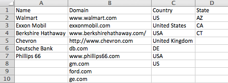

# Crear una nueva Lista de cuenta {#create-a-new-account-list}

Cree y cargue una lista de nombres de organización y dominio para destinatario de estas cuentas clave con campañas personalizadas.

>[!NOTE]
>
>Este artículo se aplica únicamente a los clientes Web ABM heredados. Si adquirió Web ABM después de septiembre de 2016, siga los pasos de [este artículo](https://docs.marketo.com/display/DOCS/Account+Lists#AccountLists-CreateaNewAccountList) en su lugar.

## Crear una nueva Lista de cuenta {#create-a-new-account-list-1}

1. Vaya a **Listas de cuenta**.

   

1. Seleccione **Crear nuevo**.

   

1. Seleccione **Examinar** y cargue el archivo CSV (asegúrese de que el archivo csv cumple los criterios). Añada un **Nombre** y **Descripción**. Haga clic en **Guardar**.

   

   >[!NOTE]
   >
   >**¿Cuál es el formato del archivo CSV?**
   >
   >
   >Asegúrese de que el archivo CSV de cuenta con nombre cumpla los siguientes requisitos:
   >
   >* Guardado como formato CSV
   >* No excede los 10 MB
   >* Sólo 4 columnas con el encabezado Columna A: Nombre, Columna B: Dominio, Columna C: País, Columna D: Estado de EE.UU.
   >* El archivo cargado puede tardar hasta 2 días laborables antes de la aprobación.
   >* Recibirá una notificación por correo electrónico de aprobación o comprobará el estado del archivo en la página Cuentas con nombre.
   >* El número total de registros/filas acumulados para todas sus listas inicios cargados a 10.000, con el paquete más grande a 100.000.

   >[!NOTE]
   >
   >**Ejemplo**
   >
   >**Ejemplo del archivo CSV**
   >
   >* Fila 1 Columna A valor = Organización
   >* Fila 1 Valor de columna B = Dominio
   >* Fila 1 Valor de columna C = País
   >* Fila 1 Valor de columna D = Estado de EE. UU.
   >* Uno de los valores de columna es obligatorio. Sin embargo, al proporcionar nombres de organización y de dominio, se mejoran las tasas de coincidencia de la Lista de cuenta.
   >* País y Estado son valores opcionales.

      >
      >  
   * Para el nombre del país, utilice el nombre completo del país o el código de abreviatura. Por ejemplo: Estados Unidos o Estados Unidos.
   >  * Para un estado de EE.UU., utilice el código de abreviatura de 2 letras, por ejemplo, CA. Solo se reconocen los estados de EE.UU.

   >    
   >

## Editar una Lista de cuenta {#edit-an-account-list}

En la página **Listas de cuenta**, haga clic en el icono **Editar **en la lista.

Seleccione **Examinar** y cargue el nuevo archivo CSV. Este archivo reemplazará al archivo original. Haga clic en **Guardar**. El nuevo archivo cargado tendrá un estado pendiente hasta que lo apruebe la asistencia técnica de marketing, cuando el archivo original permanezca activo en un estado pendiente.

El archivo CSV reemplazará al archivo existente. La lista existente permanecerá activa hasta que se complete el procesamiento del nuevo archivo.

## Eliminar una Lista de cuenta con nombre {#delete-a-named-account-list}

1. En la página **Listas de cuenta **haga clic en el icono **Eliminar **de la lista que desee eliminar.

   

1. Aparece un mensaje para confirmar si desea eliminar la lista. Haga clic en **Aceptar**.

   

>[!MORELIKETHIS]
>
>* [Crear un segmento con una Lista de cuenta](create-a-segment-using-an-account-list.md)
>* [Vista de una Lista de cuenta con nombre](https://docs.marketo.com/pages/viewpage.action?pageid=4720244)

