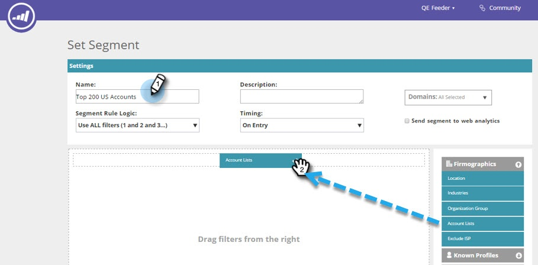
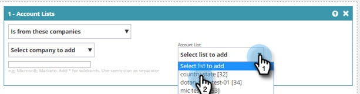

# Crear un segmento con una lista de cuentas {#create-a-segment-using-an-account-list}

A continuación se explica cómo crear un segmento mediante una lista de cuentas.

>[!PREREQUISITES]
>
>[Crear una nueva lista de cuentas](/help/marketo/product-docs/target-account-management/target/account-lists.md)

1. Vaya a **Segments**.

   

1. Haga clic en **Crear nuevo**.

   

1. Introduzca un nombre para el segmento. Arrastre y suelte **Listas de cuentas** desde la sección **Firmografías**.

   

1. Seleccione una lista de cuentas de la lista de cuentas con nombre que ha cargado. El número que aparece entre corchetes junto al nombre de la lista de cuentas es el ID de la lista para referencia de API.

   

   >[!NOTE]
   >
   >Las listas de cuentas se sincronizan de ABM a Personalización web para su uso en Segmentación. Selecciónelos en la lista desplegable. La sincronización puede tardar hasta cinco minutos. Solo se sincronizará si hay una o más cuentas con nombre en la lista de cuentas.

1. Haga clic en **Guardar** o en **Guardar y definir campaña** para ir a la página Campañas.

   

¡Felicidades! Ahora ha configurado un segmento dirigido a una lista de cuentas.
