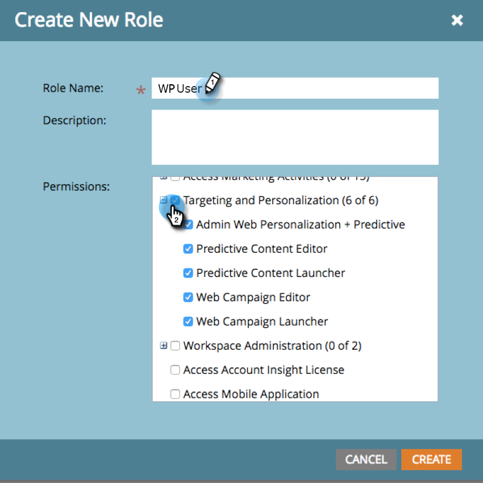

# Inicio de sesión y administración de usuarios {#login-and-user-management}

## Crear una función de usuario de personalización web {#create-a-web-personalization-user-role}

1. Vaya a la **Administrador** y, a continuación, haga clic en **Usuarios y funciones**.

   

1. Haga clic en **Funciones**.

   

   >[!NOTE]
   >
   >Si la función de usuario de personalización web (WP) ya existe, asegúrese de que esté configurada como se muestra en el paso 4.

1. Haga clic en **Nueva función**.

   

1. Introduzca un Nombre de función y seleccione Permisos. Haga clic en **Crear** (esta función debe [se aplican a todos los espacios de trabajo](/help/marketo/product-docs/administration/users-and-roles/managing-marketo-users.md)).

   

   >[!TIP]
   >
   >Para conceder permiso a los usuarios para acceder a todo lo que se encuentra en Segmentación y personalización, asegúrese de seleccionar _all_ las casillas de verificación.

## Permisos de usuario de personalización web y contenido predictivo {#web-personalization-and-predictive-content-user-permissions}

**Segmentación y personalización**: El usuario solo tiene permisos de visualización si este permiso solo está seleccionado.

**Administración de personalización web + predictivo**: El usuario solo tiene acceso a la Configuración de cuenta y a la Configuración de contenido para la aplicación de personalización web y contenido predictivo. Los usuarios pueden ver páginas en la aplicación, pero no tienen permisos de creación, edición, eliminación o inicio.

**Editor de contenido predictivo**: El usuario tiene acceso de editor a la aplicación de contenido predictivo. El permiso permite crear, editar o eliminar fragmentos de contenido. No permite habilitar el contenido para uso predictivo en la web o en el correo electrónico.

**Iniciador de contenido predictivo**: El usuario tiene acceso a todas las funciones de contenido predictivo, excepto a Configuración de cuenta y contenido. El permiso permite crear, editar, eliminar y habilitar fragmentos de contenido.

**Editor de campañas web**: El usuario tiene acceso de editor a todas las funciones de personalización web para crear, editar y eliminar, pero no para iniciar campañas web.

**Iniciador de campaña web**: El usuario tiene acceso a todas las funciones de la aplicación de personalización web, excepto a la Configuración de cuenta y contenido. El permiso permite crear, editar, eliminar e iniciar campañas web.

## Asignar la función WP al usuario {#assign-wp-role-to-user}

1. Vaya a **Usuarios**.

   

1. Seleccione el usuario al que desea conceder acceso de WP y haga clic en **Editar usuario**.

   

1. Seleccione la función de usuario WP para todos los espacios de trabajo.

   

1. Los usuarios recién habilitados verán la variable **Personalización web** en Mi Marketo la próxima vez que inicien sesión.

   
