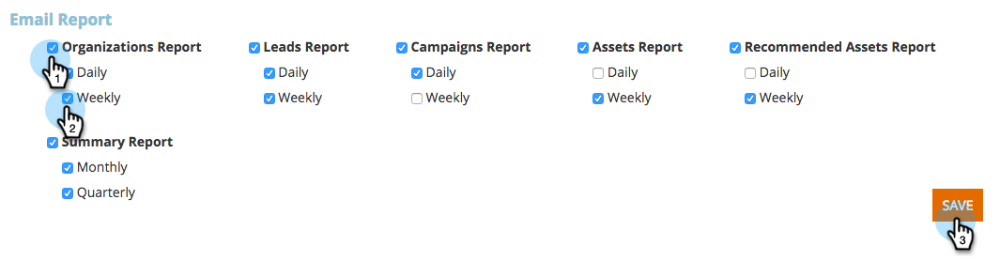

# Habilitar/deshabilitar Suscripciones de informes {#enable-disable-report-subscriptions}

La personalización web tiene varios informes útiles que se envían por correo electrónico. Así es como suscribirse a ellos.

1. Inicie sesión en Personalización web. Bajo su nombre de inicio de sesión, haga clic en **Configuración de usuario**.

   

1. Seleccione el informe al que desee suscribirse y su frecuencia. Haga clic en **Guardar**.

   

   ¡Eso es todo! Para cancelar la suscripción al informe, simplemente desmarque y haga clic en **Guardar**.
