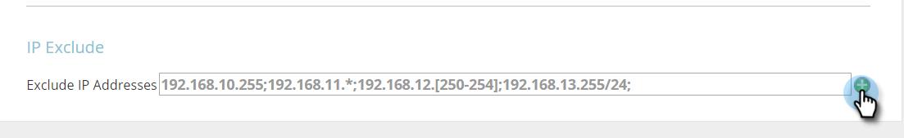

# Excluir direcciones IP específicas del seguimiento {#exclude-specific-ips-from-being-tracked}

¿Alguna vez desea excluir a sus propios empleados y al nombre de la organización del seguimiento y sistema de informes en la personalización web?

Puede excluir direcciones IP individuales y todas o parte de un rango de direcciones IP.

>[!NOTE]
>
>Este proceso puede tardar hasta cinco minutos en completarse.

1. Inicie sesión en Personalización web y, bajo su inicio de sesión, haga clic en **Configuración de cuenta**.

   

1. Desplácese hacia abajo hasta el área **IP exclude**. Si está excluyendo las direcciones IP por primera vez, haga clic en el campo vacío **Excluir direcciones IP**.

   

1. Escriba las direcciones IP individuales o los intervalos de direcciones IP que desee excluir del seguimiento y el sistema de informes y haga clic en **Guardar**.

   

   >[!NOTE]
   >
   >Puede excluir una sola dirección IPv4 o IPv6, o bien un rango completo, un semicerrado o por máscara de subred. Los elementos del ejemplo anterior muestran uno de cada uno, en función de los ejemplos proporcionados en el propio formulario de marketing.

1. El campo Excluir direcciones IP ahora lista las direcciones IP ingresadas. Para editar las exclusiones de IP, haga clic en el signo más verde para volver a abrir el formulario.

   

   ¿Viste lo fácil que fue eso? Ahora puede excluir todos los datos de las IP agregadas, ya sea individualmente o por intervalo.
